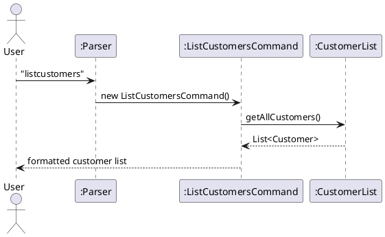
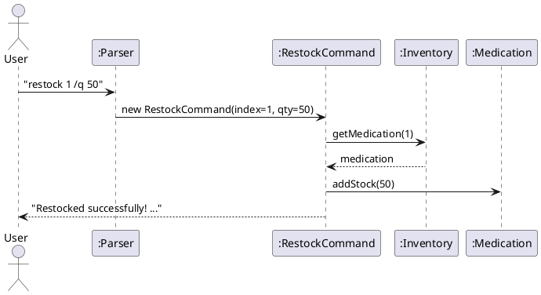
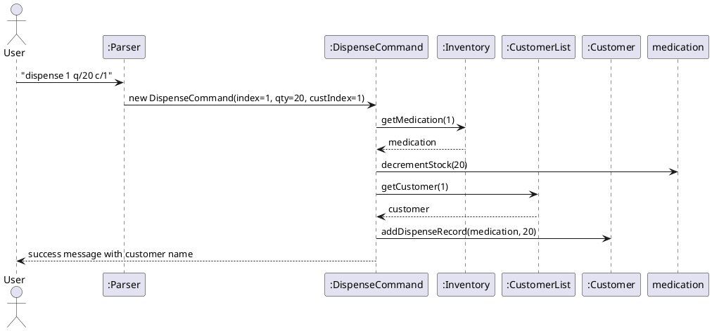

# Developer Guide

## Acknowledgements

Beyond the Java Standard Library, no other libraries were used. No code was reused as well.

## Setting up, getting started

{Update with instructions on setting up}

## Design

### Architecture

PharmaTracker employs a straightforward, command-driven architecture. The core execution loop resides within
`PharmaTracker.run()` which continuously reads user input, parses it into an executable command, executes the
command logic, and saves any modifications to local storage. 

The key components of the system are outlined below. 

| Component            | Responsibility                                                                                                                                                      |
|:---------------------|:--------------------------------------------------------------------------------------------------------------------------------------------------------------------|
| `PharmaTracker`      | Initializes the application components and manages the main execution loop (read → parse → execute → save).                                                         |
| `Parser`             | Analyzes raw input strings from the user and translates them into specific, executable `Command` objects.                                                           |
| `Command` (abstract) | Defines the required `execute()` contract. Concrete command classes (e.g., `AddCommand`, `DispenseCommand`) implement this to interact with the application's data. |
| `Inventory`          | The in-memory data structure that stores and manages all `Medication` records.                                                                                      |
| `CustomerList`       | The in-memory data structure that manages registered `Customer` profiles and their dispensing histories.                                                            |
| `Storage`            | Handles the serialization and deserialization of data to a local text file (`data/pharmatracker.txt`) to ensure data persistence across sessions.                   |
| `Ui`                 | Manages all interactions with the user, including reading terminal inputs and printing formatted outputs to the console.                                            |

The following sequence diagram illustrates the complete runtime flow of PharmaTracker, from app initialization through 
the continuous command execution loop:


### UI Component

**API:** `Ui.java`

The UI component is solely responsible for handling all interactions with the user. It resides within the `seedu.pharmatracker.ui` package and acts as the bridge between the application's internal logic and the console.

**Key Responsibilities:**
* **Input Reading:** It utilizes a `Scanner` to read raw string input from the standard input stream (CLI) via the `readCommand()` method.
* **Output Formatting:** It standardizes the application's visual output (e.g., displaying the welcome message and applying consistent dividers to frame messages).
* **Data Presentation:** It contains dedicated methods to beautifully format and display complex objects. For instance, `printMedicationDetails()` and `showCustomerDetails()` use `printf` formatting to align data cleanly into readable, tabular structures.

**Design Constraints & Rules for Developers:**
To maintain a clean architecture, the UI component is strictly separated from the logic and data models.
* **No Direct Printing:** Developers should **never** use `System.out.println()` directly within `Command`, `Parser`, or `Inventory` classes.
* **Data Handoff:** If a command needs to display a result, it must process the data and pass the relevant object to a specific method inside the `Ui` class to handle the actual printing.

The following class diagram summarizes the `Ui` component's primary API. *(Note: Private string constants and standard constructors are omitted to reduce visual clutter).*


### Command Component

{Update with information about Command Architecture}

### Parser Component

{Update with information about Parser Architecture}

### Storage Component

{Update with information about Storage Component}

## Implementation

This section describes some noteworthy details on how certain features are implemented.

### Add Medication Feature

This add-medication mechanism allows users to record a new medication
with the name, dosage, quantity and expiry date information.
```
add /n NAME /d DOSAGE /q QUANTITY /e EXPIRY [/t TAG]
```
#### How it works

The following steps describe how an add command is processed.

1. The user enters `add /n Paracetamol /d 500mg /q 100 /e 2026-12-31 
   /t Painkiller /df Tablet /warn May cause drowsiness`.
2. `PharmaTracker.run()` reads the user input and passes the raw string to `Parser.parse()`.
3. `Parser.parse()` identifies the command word `add`.
4. The parser first delegates to specific extract methods
   (`extractName()`, `extractDosage()`, `extractQuantity` and `extractExpiryDate()`).
   These methods validate that the mandatory flags (`/n`, `/d`, `/q`, `/e`) are present
   and in the correct relative order.
5. Next, the parser extracts optional attributes using the `extractFlag()` method. 
   To allow users to input optional flags in any order, `extractFlag()` relies on a helper method called
   `findNextFlagIndex()`. This helper scans the remainder of the input string against a predefined array of 
   `ALL_FLAGS` to dynamically determine where the current flag's value ends and where the next one begins. 
6. For warnings, the parser uses `extractWarnings()`, which loops through the input string to locate all
   occurrences of the `/warn` flag, compiling them into an `ArrayList<String>`.
7. All extracted values (both compulsory and optional) are passed into the `AddCommand` constructor 
   to create a new `AddCommand` object.
8. `PharmaTracker.run()` calls `AddCommand.execute()`, which creates a new `Medication` object and adds it to the `Inventory`. 
9. Finally, `Ui.printAddedMessage()` is called to display a confirmation message to the user.

The following sequence diagram shows the full flow of the add command, including parsing and inventory updates:


---

### Find Medication Feature

The `find` command searches the inventory for medications whose names contain a given keyword.
The search is case-insensitive and supports partial matches.
```
find KEYWORD
```

#### How it works

1. The user enters `find paracetamol`.
2. `PharmaTracker.run()` reads the user input and passes the raw string to `Parser.parse()`.
3. `Parser.parse()` identifies the command word `find` and extracts the remainder of the input
   as the search keyword.
4. A new `FindCommand(keyword)` object is constructed with the extracted keyword.
5. `PharmaTracker.run()` calls `FindCommand.execute()`, which calls `Inventory.getMedications()`
   to obtain the full medication list.
6. The command iterates over every `Medication`, calling `getName()` on each one. If the name
   contains the keyword (case-insensitive), the medication is added to `matchingMedications`.
7. After the loop, the result is handled via an `alt` branch:
   - If `matchingMedications` is empty, `"No medications found matching: ..."` is printed
     directly to `System.out` and the command returns early.
   - Otherwise, `Ui.printFindResults(matchingMedications)` is called to display the numbered
     list of matches.

The following sequence diagram shows the full execution flow of the `find` command:


#### Design Considerations

| Aspect | Choice | Reason |
|--------|--------|--------|
| Case-insensitive matching | `toLowerCase()` on both sides | Reduces user friction; pharmacy staff should not need to remember exact capitalisation |
| Partial match via `contains()` | Yes | A keyword like `Para` usefully returns `Paracetamol`; exact-match would be too restrictive |
| No-results path prints directly | `System.out` in command | The no-results message is a simple one-liner; a dedicated `Ui` method would be added if the message ever needed formatting |

---

### View Medication Feature

The `view` command displays the full details of a specific medication in the inventory,
identified by its 1-based index as shown in `list`.
```
view INDEX
```

#### How it works

1. The user enters `view 1`.
2. `PharmaTracker.run()` reads the user input and passes the raw string to `Parser.parse()`.
3. `Parser.parse()` identifies the command word `view` and calls `parseInt(description.trim())`
   to extract the integer index.
4. A new `ViewCommand(index)` object is constructed with the extracted index.
5. `PharmaTracker.run()` calls `ViewCommand.execute()`, which calls `Inventory.getMedications()`
   and validates the request via an `alt` block:
   - If the inventory is empty, `"Inventory is empty."` is printed directly to `System.out`
     and the command returns early.
   - If the index is out of range (less than 1 or greater than list size), `getMedications()` is
     called again to obtain the current size, an invalid-index error message is printed, and the
     command returns early.
6. For a valid index, `Inventory.getMedication(index - 1)` retrieves the target `Medication` object.
7. `Ui.printMedicationDetails(med)` is called to display the medication's full profile, including
   dosage form, manufacturer, directions, route, max daily dose, and warnings.

The following sequence diagram shows the full execution flow of the `view` command:


#### Design Considerations

| Aspect | Choice | Reason |
|--------|--------|--------|
| Two-stage guard (empty inventory, then out-of-range) | Yes | Produces a clearer error message; avoids an `IndexOutOfBoundsException` when the list is empty |
| `parseInt` in `Parser`, not `execute()` | `Parser` | Fails fast with a parse error before a command object is even created; consistent with how other index-based commands are parsed |
| Display delegated to `Ui.printMedicationDetails()` | `Ui` | Keeps the command focused on retrieval logic only; consistent with SRP enforced across the codebase |

---

### List Customers Feature

The `listcustomers` command retrieves and displays all registered customers with their ID, name, and phone number.
```
listcustomers
```

#### How it works

1. The user enters `listcustomers`.
2. `PharmaTracker.run()` passes the input to `Parser.parse()`.
3. `Parser.parse()` identifies the command word `listcustomers` and returns a `ListCustomersCommand` object (no arguments needed).
4. `PharmaTracker.run()` calls `ListCustomersCommand.execute()`, which calls `CustomerList.getAllCustomers()`.
5. If the list is empty, `Ui` displays `No customers registered yet.`
6. Otherwise, each `Customer` is printed with their ID, name, and phone number, followed by a total count.

#### Sequence Diagram



#### Design Considerations

| Aspect | Choice | Reason |
|--------|--------|--------|
| Formatting location | `ListCustomersCommand`, not `Customer.toString()` | Decouples display format from model; easier to change output later |
| Parameters | None | Read-only command; no input needed |

---

### Restock Medication Feature

The `restock` command **additively** increases the stock of an existing medication. Unlike `update` which overwrites, `restock` tops up on top of the current quantity.
```
restock INDEX /q QUANTITY
```

#### How it works

1. The user enters `restock 1 /q 50`.
2. `Parser.parse()` identifies `restock`, extracts the index and `/q` quantity.
3. A `RestockCommand` object is created with the index and quantity.
4. `RestockCommand.execute()` retrieves the `Medication` at the given index from `Inventory`.
5. `medication.addStock(quantity)` is called to increment the existing stock.
6. `Ui` confirms with the medication name, added units, and updated stock total.

#### Sequence Diagram



#### Design Considerations

| Aspect | Choice | Reason |
|--------|--------|--------|
| Separate from `update` | Yes | Prevents accidental overwrite during restocking; makes intent explicit |
| Additive vs overwrite | Additive | Matches real-world shipment top-up behaviour |

---

### Dispense with Customer Linking Feature

Extends the existing `dispense` command with an optional `c/CUSTOMER_INDEX` flag. When provided, the dispensed medication is recorded into that customer's dispensing history. Omitting `/c` retains the original behaviour exactly.
```
dispense INDEX q/QUANTITY [c/CUSTOMER_INDEX]
```

#### How it works

1. The user enters `dispense 1 q/20 c/1`.
2. `Parser.parse()` identifies `dispense`, extracts the medication index, `q/` quantity, and optionally `c/` customer index.
3. A `DispenseCommand` is constructed with `customerIndex` set to `1` (or `null` if `/c` is omitted).
4. `DispenseCommand.execute()`:
   - Retrieves the medication from `Inventory` and decrements stock unconditionally.
   - If `customerIndex` is non-null, retrieves the `Customer` from `CustomerList` and calls `customer.addDispenseRecord(medication, quantity)`.
5. `Ui` confirms with medication name, amount, updated stock, and customer name if linked.

#### Sequence Diagram



#### Design Considerations

| Aspect | Choice | Reason |
|--------|--------|--------|
| Optional `/c` flag vs separate command | Optional flag | Avoids duplicating stock-decrement logic; backward compatible |
| Record stored in `Customer` vs `Medication` | `Customer` | Querying a customer's full history is natural; avoids scanning all medications |
| `null` for absent customer | `null` check before lookup | Clean guard; no dummy customer object needed |

---

### View Customer Feature

The `view-customer` command allows pharmacy staff to retrieve and display the full profile of a
specific customer, including their ID, name, phone number, address, and complete dispensing history.
```
view-customer INDEX
```

#### How it works

1. The user enters `view-customer 1`.
2. `PharmaTracker.run()` reads the user input and passes the raw string to `Parser.parse()`.
3. `Parser.parse()` identifies the command word `view-customer` and extracts the integer index
   from the remainder of the input string.
4. The extracted index is used to construct a new `ViewCustomerCommand` object.
5. `PharmaTracker.run()` calls `ViewCustomerCommand.execute()`, which first checks
   `CustomerList.size()` to validate the request:
   - If the customer list is empty, `"No customers registered yet."` is printed directly and
     the command returns early.
   - If the index is out of range (less than 1 or greater than list size), an invalid-index
     error message is printed and the command returns early.
6. For a valid index, `CustomerList.getCustomer(index - 1)` retrieves the target `Customer` object.
7. Finally, `Ui.showCustomerDetails(customer)` is called to display the customer's full details,
   including their dispensing history (or a `"No medications dispensed yet."` message if the
   history is empty).

The following sequence diagram shows the full execution flow of the `view-customer` command:


#### Design Considerations

| Aspect | Choice | Reason |
|--------|--------|--------|
| Index validation in `execute()`, not `Parser` | `execute()` | Index validity depends on the live `CustomerList` size, which the stateless parser does not hold |
| Two-stage guard (empty list, then out-of-range) | Yes | Produces a clearer error message; avoids an `IndexOutOfBoundsException` when the list is empty |
| Display delegated to `Ui.showCustomerDetails()` | `Ui` | Keeps display logic out of the command class; consistent with the SRP enforced across the codebase |

---

### Update Customer Feature

The `updatecustomer` command allows pharmacy staff to update one or more fields of an existing customer record.
Only the fields explicitly provided are changed; all other fields remain unchanged.
```
updatecustomer INDEX [/n NAME] [/p PHONE] [/a ADDRESS]
```

#### How it works

1. The user enters `updatecustomer 1 /n Alice /p 91234567 /a 123 Main St`.
2. `PharmaTracker.run()` passes the input to `Parser.parse()`.
3. `Parser.parse()` identifies the command word `updatecustomer`.
4. The parser splits the description into the 1-based index and a trailing argument string. It then calls `extractCustomerUpdateFlag()` for each of the `/n`, `/p`, and `/a` flags. Flags that are absent return `null`.
5. An `UpdateCustomerCommand` is constructed with the index and the three (nullable) field values.
6. `UpdateCustomerCommand.execute()` validates the index against `CustomerList.size()`. If no flags were supplied (all three are `null`), it prints an error and returns early.
7. For each non-null field, the corresponding setter (`customer.setName()`, `customer.setPhone()`, `customer.setAddress()`) is called on the retrieved `Customer` object.
8. `Ui.printUpdatedCustomerMessage(customer)` confirms the update to the user.


#### Design Considerations

| Aspect | Choice | Reason |
|--------|--------|--------|
| `null` for absent flags | Yes | Cleanly distinguishes "not provided" from an empty string; avoids silent overwrites |
| Partial update vs full replacement | Partial | Users should not have to re-enter unchanged fields |
| Validation location | `execute()`, not `Parser` | Keeps parser stateless; index validity requires live `CustomerList` size |

---

### Low Stock Feature

The `lowstock` command displays all medications whose quantity falls below a threshold.
The default threshold is **20 units**, and an optional `/threshold` flag lets users specify a custom value.
```
lowstock [/threshold NUMBER]
```

#### How it works

1. The user enters `lowstock` or `lowstock /threshold 10`.
2. `PharmaTracker.run()` passes the input to `Parser.parse()`.
3. `Parser.parse()` identifies the command word `lowstock`. If the `/threshold` flag is present, its integer value is parsed; otherwise `LowStockCommand.DEFAULT_THRESHOLD` (20) is used.
4. A `LowStockCommand` object is created with the resolved threshold.
5. `LowStockCommand.execute()` iterates over every `Medication` in the `Inventory`. Any medication whose `quantity < threshold` is collected into a list.
6. `Ui.printLowStockList(lowStockMeds, threshold)` displays the filtered list with the active threshold, or a message stating all stock is sufficient.


#### Design Considerations

| Aspect | Choice | Reason |
|--------|--------|--------|
| Default threshold of 20 | `DEFAULT_THRESHOLD` constant | Provides a sensible out-of-the-box value without requiring user input |
| Strict `<` vs `<=` | `<` (strict less-than) | A medication at exactly the threshold is considered adequately stocked |
| Optional `/threshold` flag | Optional | Keeps the command simple for common use while supporting custom thresholds |

---

### Expiring Medications Feature

The `expiring` command scans the inventory and reports medications that have already passed their
expiry date, as well as those expiring within a configurable number of days. It defaults to a
30-day window if no argument is provided.
```
expiring [/days DAYS]
```

#### How it works

1. The user enters `expiring /days 14` (or just `expiring`).
2. `PharmaTracker.run()` reads the user input and passes the raw string to `Parser.parse()`.
3. `Parser.parse()` identifies the command word `expiring` and checks for the optional `/days` flag:
   - If `/days` is **absent**, a default `ExpiringCommand` is constructed using the no-argument
     constructor, which sets the window to `DEFAULT_DAYS` (30).
   - If `/days` is **present**, the parser calls `parseInt()` on the extracted value to obtain the
     number of days, then constructs `ExpiringCommand(days)` with that value.
4. `PharmaTracker.run()` calls `ExpiringCommand.execute()`, which calls
   `Inventory.getMedications()` to obtain the full medication list.
5. The command iterates over every `Medication`. For each one, `getExpiryDate()` is called:
   - If the expiry date is `null` or cannot be parsed, the medication is **skipped**.
   - If the expiry date is **before today**, the medication is added to `expiredMeds`.
   - If the expiry date falls **within the cutoff window** (today through today + days), the
     medication is added to `expiringMeds`.
6. `Ui.showExpiringMedications(expiredMeds, expiringMeds, days)` is called to display the
   results. If both lists are empty, a single `"No expired or expiring medications found."` message
   is shown. Otherwise, expired and soon-to-expire medications are displayed in two labelled sections.

The following sequence diagram shows the full execution flow of the `expiring` command:


#### Design Considerations

| Aspect | Choice | Reason |
|--------|--------|--------|
| Default window of 30 days | `DEFAULT_DAYS` constant | Provides a sensible out-of-the-box value; avoids requiring user input for the common case |
| Skip medications with unparseable expiry | Silent skip | Prevents a single bad record from crashing the entire scan; logged for debugging |
| Two separate result lists (`expiredMeds`, `expiringMeds`) | Yes | Allows the `Ui` to present expired and soon-to-expire items in clearly labelled sections, giving staff immediately actionable information |
| Display delegated to `Ui.showExpiringMedications()` | `Ui` | Consistent with SRP; the command handles filtering logic only and hands display responsibility to `Ui` |

---

## Product scope

### Target user profile

Pharmacy staff (pharmacists, pharmacy technicians) who:
- Need to manage a medication inventory in a small to mid-size pharmacy
- Prefer a fast CLI-based workflow over GUI applications
- Are comfortable typing commands and can type quickly
- Need to track medication stock, expiry dates, and dispensing

### Value proposition

Fast, lightweight medication tracking without needing a database or internet connection

## User Stories

| Version | As a ...            | I want to ...                          | So that I can ...                                  |
|---------|---------------------|----------------------------------------|----------------------------------------------------|
| v1.0    | new user            | see usage instructions                 | refer to them when I forget how to use the app     |
| v1.0    | pharmacist          | add medications to inventory           | track stock levels                                 |
| v1.0    | pharmacist          | list all medications                   | see what is currently in stock                     |
| v1.0    | pharmacist          | delete a medication                    | remove discontinued or incorrect entries           |
| v1.0    | pharmacist          | find medication by keyword             | quickly locate a specific drug without scrolling   |
| v1.0    | pharmacist          | sort medications by expiry date        | identify medications expiring soon                 |
| v1.0    | pharmacist          | view detailed medication information   | check dosage form, directions, and warnings        |
| v2.0    | pharmacist          | print a medication label               | attach it to dispensed packages                    |
| v2.0    | pharmacist          | view all registered customers          | reference their details quickly                    |
| v2.0    | pharmacist          | restock a medication                   | top up stock when a new shipment arrives           |
| v2.0    | pharmacist          | link a dispense event to a customer    | maintain each customer's medication history        |
| v2.0    | pharmacist          | update a customer's details            | keep customer records current and accurate         |
| v2.0    | pharmacist          | check which medications are low stock  | reorder before supplies run out                    |

## Non-Functional Requirements

{Give non-functional requirements}

## Glossary

* *glossary item* - Definition

## Instructions for manual testing

{Give instructions on how to do a manual product testing e.g., how to load sample data to be used for testing}

### Launching the application

1. Open a terminal in the project root directory.
2. Run `./gradlew run` (Linux/macOS) or `.\gradlew run` (Windows).
3. The welcome banner and `Enter command:` prompt should appear.

### Adding a medication

1. Enter: `add /n Paracetamol /d 500mg /q 100 /e 2026-12-31 /t painkiller`
2. **Expected:** Confirmation message showing the medication was added.
3. With optional fields: `add /n Amoxicillin /d 250mg /q 50 /e 2026-06-01 /t antibiotic /df Capsule /mfr Pfizer /warn "May cause allergic reactions"`

### Listing medications

1. Enter: `list`
2. **Expected:** All medications displayed with index, name, dosage, quantity, expiry, and tag. Items with quantity ≤ 10 show `[LOW STOCK]`.

### Finding a medication

1. Enter: `find Paracetamol`
2. **Expected:** All medications whose name contains "Paracetamol" (case-insensitive) are listed.

### Listing customers

1. Enter: `listcustomers`
2. **Expected (with customers):** Numbered list showing `[C001] John Tan | Phone: 99887766`, followed by total count.
3. **Expected (no customers):** `No customers registered yet.`

### Restocking a medication

1. Enter: `restock 1 /q 50`
2. **Expected:** Confirmation showing medication name, units added, and updated stock total.
3. Invalid index: `restock 99 /q 50` → error message for out-of-bounds index.
4. Invalid quantity: `restock 1 /q -10` → error message for non-positive quantity.

### Dispensing with customer linking

1. Enter: `dispense 1 q/20 c/1`
2. **Expected:** Stock reduced by 20, confirmation includes customer ID and name.
3. Without customer: `dispense 1 q/20` → behaves as original, no customer info in output.
4. Invalid customer index: `dispense 1 q/20 c/99` → error message for out-of-bounds customer index.

### Updating a customer

1. Enter: `updatecustomer 1 /n Alice Tan /p 91234567`
2. **Expected:** Confirmation showing updated customer details; address is unchanged.
3. All fields: `updatecustomer 1 /n Alice Tan /p 91234567 /a 10 Orchard Road` → all three fields updated.
4. No flags supplied: `updatecustomer 1` → error `No fields provided to update! Use /n, /p, or /a flags.`
5. Invalid index: `updatecustomer 99 /n Alice` → error message for out-of-bounds index.

### Checking low stock

1. Enter: `lowstock`
2. **Expected:** All medications with quantity below 20 (default threshold) are listed with their name, dosage, quantity, and expiry.
3. Custom threshold: `lowstock /threshold 10` → lists medications with quantity below 10.
4. No low-stock items: a message stating all medications are sufficiently stocked is shown.
5. Invalid threshold: `lowstock /threshold abc` → error message for non-integer threshold.
