# Developer Guide

## Table of Contents

- [Acknowledgements](#acknowledgements)
- [Setting up, getting started](#setting-up-getting-started)
- [Design](#design)
    - [Architecture](#architecture)
    - [Command Component](#command-component)
    - [Storage Component](#storage-component)
    - [UI Component](#ui-component)
- [Implementation](#implementation)
    - [Add Medication Feature](#add-medication-feature)
    - [Delete Medication Feature](#delete-medication-feature)
    - [Find Medication Feature](#find-medication-feature)
    - [View Medication Feature](#view-medication-feature)
    - [Update Medication Feature](#update-medication-feature)
    - [List Medication Feature](#list-medication-feature)
    - [List Customers Feature](#list-customers-feature)
    - [Restock Medication Feature](#restock-medication-feature)
    - [Dispense with Customer Linking Feature](#dispense-with-customer-linking-feature)
    - [View Customer Feature](#view-customer-feature)
    - [Update Customer Feature](#update-customer-feature)
    - [Sort Medication Feature](#sort-medication-feature)
    - [Low Stock Feature](#low-stock-feature)
    - [Expiring Medications Feature](#expiring-medications-feature)
    - [Label Feature](#label-feature)
    - [Daily Dispense Log Feature](#daily-dispense-log-feature)
    - [User Authentication Feature](#user-authentication-feature)
    - [Auto Restock Alerts Feature](#auto-restock-alerts-feature)
    - [Management of Customers](#management-of-customers)
- [Product scope](#product-scope)
    - [Target user profile](#target-user-profile)
    - [Value proposition](#value-proposition)
- [User Stories](#user-stories)
- [Non-Functional Requirements](#non-functional-requirements)
- [Glossary](#glossary)
- [Instructions for manual testing](#instructions-for-manual-testing)
    - [Launching the application](#launching-the-application)
    - [Adding a medication](#adding-a-medication)
    - [Listing medications](#listing-medications)
    - [Finding a medication](#finding-a-medication)
    - [Listing customers](#listing-customers)
    - [Restocking a medication](#restocking-a-medication)
    - [Dispensing with customer linking](#dispensing-with-customer-linking)
    - [Updating a customer](#updating-a-customer)
    - [Checking low stock](#checking-low-stock)
    - [Viewing the daily dispense log](#viewing-the-daily-dispense-log)

## Acknowledgements

Beyond the Java Standard Library, no other libraries were used. No code was reused as well.

## Setting up, getting started

1. Ensure Java 17 or above is installed on your computer.
2. Download the latest `pharmatracker.jar` from the releases page.
3. Open a terminal in the folder containing the jar file.
4. Run `java -jar pharmatracker.jar` to start the application.
5. Type a command and press Enter to execute it. Type `help` to see available commands.

> **Note for developers:** Run `.\gradlew run` (Windows) or `./gradlew run` (macOS/Linux) from the project root to launch the app.

## Design

### Architecture

PharmaTracker employs a straightforward, command-driven architecture. The core execution loop resides within
`PharmaTracker.run()` which continuously reads user input, parses it into an executable command, executes the
command logic, and saves any modifications to local storage. 

The key components of the system are outlined below. 

| Component            | Responsibility                                                                                                                                                      |
|:---------------------|:--------------------------------------------------------------------------------------------------------------------------------------------------------------------|
| `PharmaTracker`      | Initializes the application components and manages the main execution loop (read → parse → execute → save).                                                         |
| `Parser`             | Analyzes raw input strings from the user and translates them into specific, executable `Command` objects.                                                           |
| `Command` (abstract) | Defines the required `execute()` contract. Concrete command classes (e.g., `AddCommand`, `DispenseCommand`) implement this to interact with the application's data. |
| `Inventory`          | The in-memory data structure that stores and manages all `Medication` records.                                                                                      |
| `CustomerList`       | The in-memory data structure that manages registered `Customer` profiles and their dispensing histories.                                                            |
| `AuthService`        | Manages user registration/login/logout, password verification, and current session state.                                                                            |
| `RestockAlertService`| Evaluates stock against medication thresholds, tracks active alerts, and maintains alert history.                                                                    |
| `Storage`            | Handles the serialization and deserialization of data to a local text file (`data/pharmatracker.txt`) to ensure data persistence across sessions.                   |
| `Ui`                 | Manages all interactions with the user, including reading terminal inputs and printing formatted outputs to the console.                                            |

The following component diagram provides a high-level overview of how these components relate to one another:

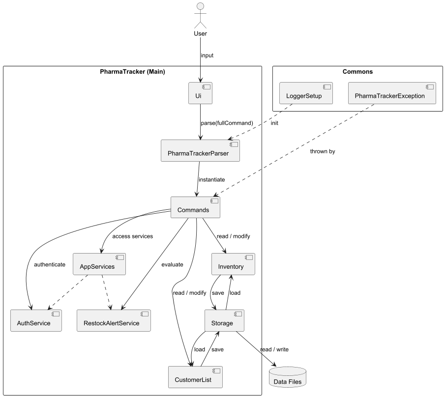

A few key relationships to note:

- **User → UI → Parser → Commands**: The main data flow follows a strict top-down path. The user interacts exclusively with `Ui`, which hands raw input to `PharmaTrackerParser`. The parser instantiates the appropriate `Command` subclass, which is then executed by the main loop.
- **Commands → AppServices → AuthService / RestockAlertService**: Commands do not call `AuthService` or `RestockAlertService` directly. Instead, they go through `AppServices`, a static singleton that acts as a service locator. This avoids passing service references through every constructor and keeps the `Command` API clean.
- **Commands ↔ Storage ↔ Model**: `Commands` read and modify the in-memory `Inventory` and `CustomerList`. After each command executes, `PharmaTracker` delegates to `Storage` to persist those changes to disk.
- **Commons (dashed)**: `LoggerSetup` and `PharmaTrackerException` are shared utilities consumed across the application. They are shown with dashed lines to indicate a supporting dependency rather than a primary data flow.

The following sequence diagram illustrates the complete runtime flow of PharmaTracker, from app initialization through 
the continuous command execution loop:


### Command Component

The `Command` component follows the Command pattern. Every command implements the `execute(Inventory inventory, Ui ui, CustomerList customerList)` method. The addition of `CustomerList` to the execution signature ensures that all commands have immediate access to both datasets, enabling cross-entity operations like linking a sale to a patient.

### Storage Component

The `Storage` component handles the persistence of both medications and patient records.
* **Medication Data**: Serialized to `data/pharmatracker.txt`.
* **Customer Data**: Serialized to `data/customers.txt`.
  The system uses a pipe-delimited format for high-level attributes. For patient dispensing history, which can contain multiple entries, the data is collapsed into a single string segment using a semicolon separator (`;`) to prevent line-break corruption in the text file.

### UI Component

**API:** `Ui.java`

The UI component is solely responsible for handling all interactions with the user. It resides within the `seedu.pharmatracker.ui` package and acts as the bridge between the application's internal logic and the console.

**Key Responsibilities:**
* **Input Reading:** It utilizes a `Scanner` to read raw string input from the standard input stream (CLI) via the `readCommand()` method.
* **Output Formatting:** It standardizes the application's visual output (e.g., displaying the welcome message and applying consistent dividers to frame messages).
* **Data Presentation:** It contains dedicated methods to beautifully format and display complex objects. For instance, `printMedicationDetails()` and `showCustomerDetails()` use `printf` formatting to align data cleanly into readable, tabular structures.

**Design Constraints & Rules for Developers:**
To maintain a clean architecture, the UI component is strictly separated from the logic and data models.
* **No Direct Printing:** Developers should **never** use `System.out.println()` directly within `Command`, `Parser`, or `Inventory` classes.
* **Data Handoff:** If a command needs to display a result, it must process the data and pass the relevant object to a specific method inside the `Ui` class to handle the actual printing.

## Implementation

This section describes some noteworthy details on how certain features are implemented.

---

### Add Medication Feature

This add-medication mechanism allows users to record a new medication with mandatory details (name, dosage, quantity, and expiry date) as well as comprehensive optional clinical information.
```
add /n NAME /d DOSAGE /q QUANTITY /e EXPIRY [/t TAG] [/df DOSAGE_FORM] [/mfr MANUFACTURER] [/dir DIRECTIONS] [/freq FREQUENCY] [/route ROUTE] [/max MAX_DAILY_DOSE] [/warn WARNING]
```
#### How it works

The following steps describe how an add command is processed.

1. The user enters `add /n Paracetamol /d 500mg /q 100 /e 2026-12-31 /t Painkiller /df Tablet /warn May cause drowsiness`.
2. `PharmaTracker.run()` reads the user input and passes the raw string to `PharmaTrackerParser.parse()`.
3. `PharmaTrackerParser.parse()` identifies the command word `add` and delegates the remaining description string to `AddCommandParser.parse()`.
4. `AddCommandParser` first uses specific extraction methods from `MedicationParserUtil` (`extractName()`, `extractDosage()`, `extractQuantity()`, and `extractExpiryDate()`). These methods validate that the mandatory flags (`/n`, `/d`, `/q`, `/e`) are present, properly formatted, and in the correct relative order.
5. Next, the parser extracts the optional attributes (Tag, Dosage Form, Manufacturer, Directions, Frequency, Route, Max Daily Dose) using the `ParserUtil.extractFlag()` method. To allow users to input optional flags in any order, `extractFlag()` relies on a helper method called `findNextFlagIndex()`. This helper scans the remainder of the input string against a predefined array of `ALL_FLAGS` to dynamically determine where the current flag's value ends and where the next one begins.
6. For warnings, the parser uses `MedicationParserUtil.extractWarnings()`, which loops through the input string to locate all occurrences of the `/warn` flag, compiling them into an `ArrayList<String>`.
7. All extracted values (both compulsory and optional) are passed into the `AddCommand` constructor to create a new `AddCommand` object.
8. `PharmaTracker.run()` calls `AddCommand.execute()`, which creates a new `Medication` object and adds it to the `Inventory`. 
9. Finally, `Ui.printAddedMessage()` is called to display a confirmation message to the user.

The following class diagram shows the interaction between the `AddCommand` class with other classes. 

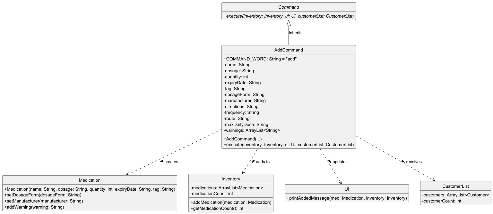

The following sequence diagram shows the full flow of the add command, including parsing and inventory updates:

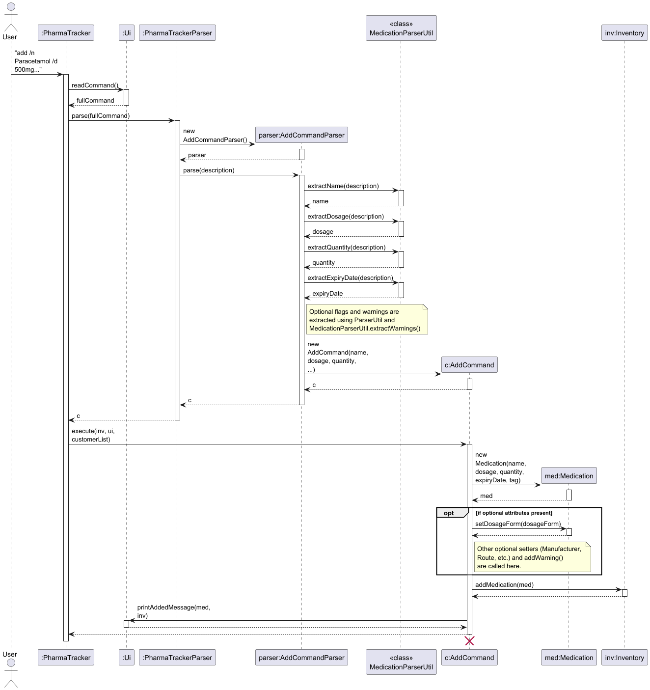
---

### Delete Medication Feature

The `delete` command allows users to remove an existing medication from the inventory. The medication to be removed is
identified by its 1-based index as displayed in the inventory list.

```
delete INDEX
```

The following steps describe how a delete command is processed.

1. The user enters a delete command into the command line, specifying the index of the medication (e.g. `delete 1`)
2. `PharmaTracker.run()` reads the raw input string using `ui.readCommand()`.
3. `PharmaTracker` passes the string to `PharmaTrackerParser.parse()`.
4. `PharmaTrackerParser` identifies the `delete` command word, extracts the provided index string, and instantiates a new `DeleteCommand` object with this description.
5. `PharmaTracker` calls the `execute(inventory, ui, customerList)` method on the newly created `DeleteCommand`.
6. Inside the `execute` method, the string index is parsed into an integer and converted from a 1-based index to a 0-based index to match the internal `ArrayList` logic.
7. The specific `Medication` object is retrieved from the `Inventory` using the `getMedication(zeroBasedIndex)`method.
8. The retrieved `Medication` object is passed to `inventory.removeMedication()`, which deletes it from the internal list and decrements the medication count.
9. The `DeleteCommand` calls `ui.printDeletedMessage()` to display a success message to the user.

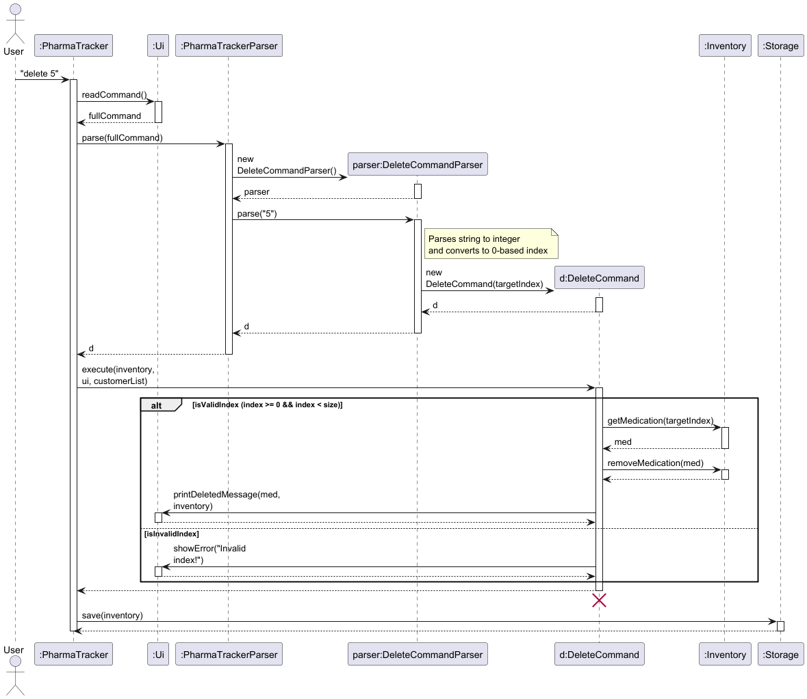

### Find Medication Feature

The `find` command searches the inventory for medications whose names contain a given keyword.
The search is case-insensitive and supports partial matches.
```
find KEYWORD
```

#### How it works

1. The user enters `find paracetamol`.
2. `PharmaTracker.run()` reads the user input and passes the raw string to `Parser.parse()`.
3. `Parser.parse()` identifies the command word `find` and extracts the remainder of the input
   as the search keyword.
4. A new `FindCommand(keyword)` object is constructed with the extracted keyword.
5. `PharmaTracker.run()` calls `FindCommand.execute()`, which calls `Inventory.getMedications()`
   to obtain the full medication list.
6. The command iterates over every `Medication`, calling `getName()` on each one. If the name
   contains the keyword (case-insensitive), the medication is added to `matchingMedications`.
7. After the loop, the result is handled via an `alt` branch:
   - If `matchingMedications` is empty, `"No medications found matching: ..."` is printed
     directly to `System.out` and the command returns early.
   - Otherwise, `Ui.printFindResults(matchingMedications)` is called to display the numbered
     list of matches.

The following sequence diagram shows the full execution flow of the `find` command:

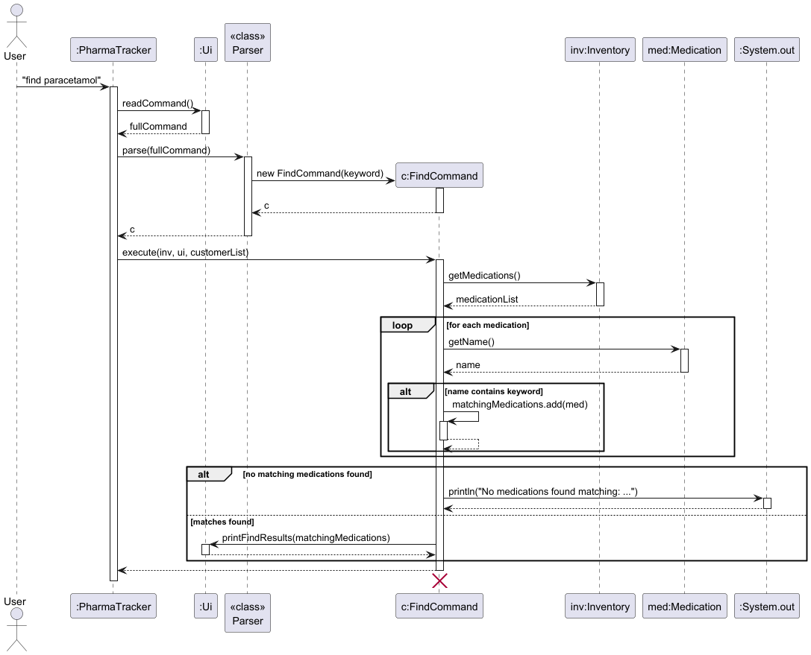

#### Design Considerations

| Aspect | Choice | Reason |
|--------|--------|--------|
| Case-insensitive matching | `toLowerCase()` on both sides | Reduces user friction; pharmacy staff should not need to remember exact capitalisation |
| Partial match via `contains()` | Yes | A keyword like `Para` usefully returns `Paracetamol`; exact-match would be too restrictive |
| No-results path prints directly | `System.out` in command | The no-results message is a simple one-liner; a dedicated `Ui` method would be added if the message ever needed formatting |

---

### View Medication Feature

The `view` command displays the full details of a specific medication in the inventory,
identified by its 1-based index as shown in `list`.
```
view INDEX
```

#### How it works

1. The user enters `view 1`.
2. `PharmaTracker.run()` reads the user input and passes the raw string to `Parser.parse()`.
3. `Parser.parse()` identifies the command word `view` and calls `parseInt(description.trim())`
   to extract the integer index.
4. A new `ViewCommand(index)` object is constructed with the extracted index.
5. `PharmaTracker.run()` calls `ViewCommand.execute()`, which calls `Inventory.getMedications()`
   and validates the request via an `alt` block:
   - If the inventory is empty, `"Inventory is empty."` is printed directly to `System.out`
     and the command returns early.
   - If the index is out of range (less than 1 or greater than list size), `getMedications()` is
     called again to obtain the current size, an invalid-index error message is printed, and the
     command returns early.
6. For a valid index, `Inventory.getMedication(index - 1)` retrieves the target `Medication` object.
7. `Ui.printMedicationDetails(med)` is called to display the medication's full profile, including
   dosage form, manufacturer, directions, route, max daily dose, and warnings.

The following sequence diagram shows the full execution flow of the `view` command:

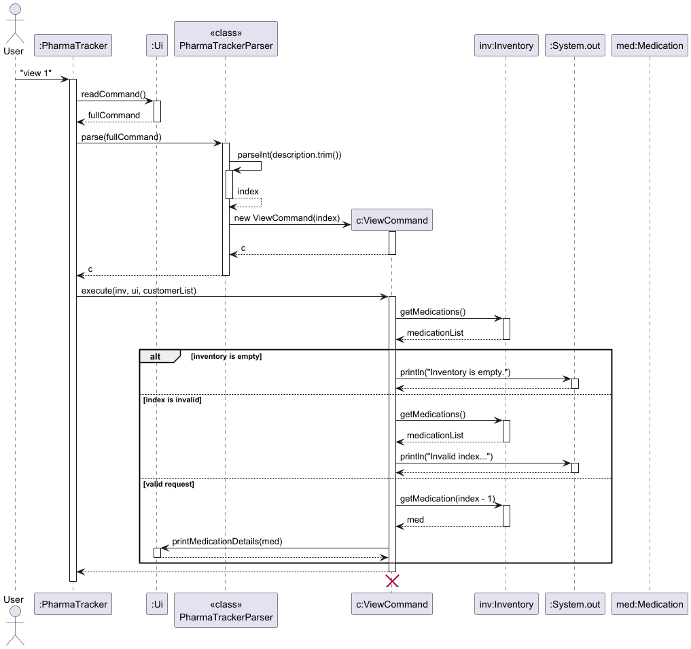

#### Design Considerations

| Aspect | Choice | Reason |
|--------|--------|--------|
| Two-stage guard (empty inventory, then out-of-range) | Yes | Produces a clearer error message; avoids an `IndexOutOfBoundsException` when the list is empty |
| `parseInt` in `Parser`, not `execute()` | `Parser` | Fails fast with a parse error before a command object is even created; consistent with how other index-based commands are parsed |
| Display delegated to `Ui.printMedicationDetails()` | `Ui` | Keeps the command focused on retrieval logic only; consistent with SRP enforced across the codebase |

---
## Update Medication Feature

The `update` command allows users to modify one or more fields of an existing medication record in the inventory without having to delete and re-add the item. Any field not explicitly specified in the command remains unchanged.

### Command Format
```
update INDEX [/n NAME] [/d DOSAGE] [/q QUANTITY] [/e EXPIRY] [/t TAG] [/df DOSAGE_FORM] [/mfr MANUFACTURER] [/dir DIRECTIONS] [/freq FREQUENCY] [/route ROUTE] [/max MAX_DAILY_DOSE] [/warn WARNINGS...]
```

### How It Works

1. The user enters an update command, e.g., `update 1 /q 50 /t Urgent`.
2. `PharmaTracker.run()` reads the input and passes the raw string to `PharmaTrackerParser.parse()`.
3. `PharmaTrackerParser.parse()` identifies the command word `update` and delegates the remaining arguments string to `UpdateCommandParser.parse()`.
4. `UpdateCommandParser` isolates the target index and extracts the optional flags using utility methods like `ParserUtil.extractOptionalFlag()`, `MedicationParserUtil.extractOptionalQuantity()`, and `MedicationParserUtil.extractWarnings()`. These methods return the updated values, or null (and empty lists for warnings) if a flag is absent.
5. An `UpdateCommand` object is instantiated with the index and the extracted fields. Unspecified fields are passed as `null`.
6. `PharmaTracker.run()` calls `UpdateCommand.execute()`, which validates the target index against the current size of the inventory. If invalid, an error message is printed and the command returns early.
7. For a valid index, the corresponding `Medication` object is retrieved from the `Inventory`.
8. The command sequentially checks each field. If a field is not `null`, the respective setter method (e.g., `setQuantity()`, `setTag()`) is called on the `Medication` object.
9. As fields are updated, descriptions of the changes are appended to an `ArrayList<String> changes`.
10. Finally, `Ui.printUpdatedMedicationMessage()` is called with the updated `Medication` and the `changes` list to generate a dynamic success message showing exactly what was modified.


---
### List Medication Feature

The `list` feature provides a summary view of the entire inventory, allowing users to identify item indices for subsequent operations.

#### How it works

1.  The user enters the `list` command into the CLI.
2.  `PharmaTracker.run()` reads the input and passes the raw string to `Parser.parse()`.
3.  `Parser.parse()` identifies the command word `list` and returns a new `ListCommand` object.
4.  `PharmaTracker.run()` calls `ListCommand.execute()`.
5.  `ListCommand.execute()` retrieves the list of all medications from `Inventory.getMedications()`.
6.  The command iterates through the collection. For each `Medication` object:
    * It retrieves the name, dosage, quantity, and expiry date.
    * It checks the stock level; if the quantity is $\leq 10$, a `[LOW STOCK]` indicator is appended to the output string.
7.  The formatted list is passed to the `Ui` component for display, followed by a summary count of total medications.

#### Design Considerations

| Aspect | Choice | Reason |
|:--- |:--- |:--- |
| **Information Density** | High-level summary | Keeps the output clean and scannable; users can use `view` for full details. |
| **Index Alignment** | 1-based numbering | Ensures the index shown to the user matches the input requirements for index-based commands. |
| **Stock Warning** | Hardcoded threshold ($\leq 10$) | Provides immediate visual priority for items needing replenishment without requiring a separate query. |

### Manual Testing: List Feature

1.  **Test case:** `list` (with items in inventory)
2.  **Expected:** A numbered list appears. Each line follows the format `NAME | DOSAGE | Qty: QUANTITY | Expiry: DATE`.
3.  **Low stock check:** Verify that any item with a quantity of 10 or less displays the `[LOW STOCK]` tag.
4.  **Summary check:** Ensure the "Total Medications" count at the bottom matches the number of items listed.

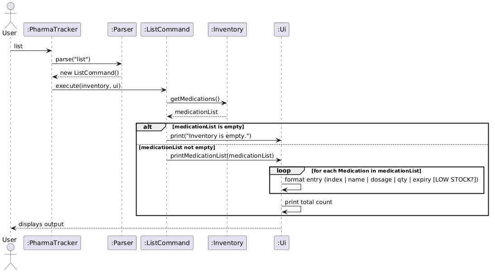

---
### Add Customer Feature

The `add-customer` command allows users to register a new customer profile in the database. This profile stores the customer's unique ID, name, contact number, and optionally, their residential address, enabling the system to track their dispensing history later.

#### How it works

1. The user enters the command into the CLI, specifying the customer details (e.g., `add-customer /id C001 /n John Doe /p 91234567 /a 123 Clementi Rd`).
2. `PharmaTracker.run()` reads the input and passes the raw string to `PharmaTrackerParser.parse()`.
3. `PharmaTrackerParser` identifies the `add-customer` command word and delegates the remaining argument string to `AddCustomerCommandParser.parse()`.
4. `AddCustomerCommandParser` extracts the required and optional fields using `CustomerParserUtil`.
5. The extraction methods (`extractCustomerID()`, `extractCustomerName()`, and `extractCustomerPhone()`) validate that the mandatory flags (`/id`, `/n`, `/p`) are present and in the correct relative order.
6. The phone number extraction also strictly verifies that the number is a valid Singaporean format (starting with '8' or '9').
7. `extractCustomerAddress()` attempts to find the `/a` flag; if absent, it safely returns an empty string.
8. The extracted strings are passed into the `AddCustomerCommand` constructor to instantiate the command object.
9. `PharmaTracker` calls the `execute()` method on the newly created `AddCustomerCommand`.
10. Inside the `execute()` method, a new `Customer` object is instantiated using the parsed details.
11. The newly created `Customer` is passed to `customerList.addCustomer()`, appending them to the active database and incrementing the total customer count.
12. Finally, the command calls `Ui.printAddedCustomerMessage()` to display a success confirmation and the updated customer tally to the user.

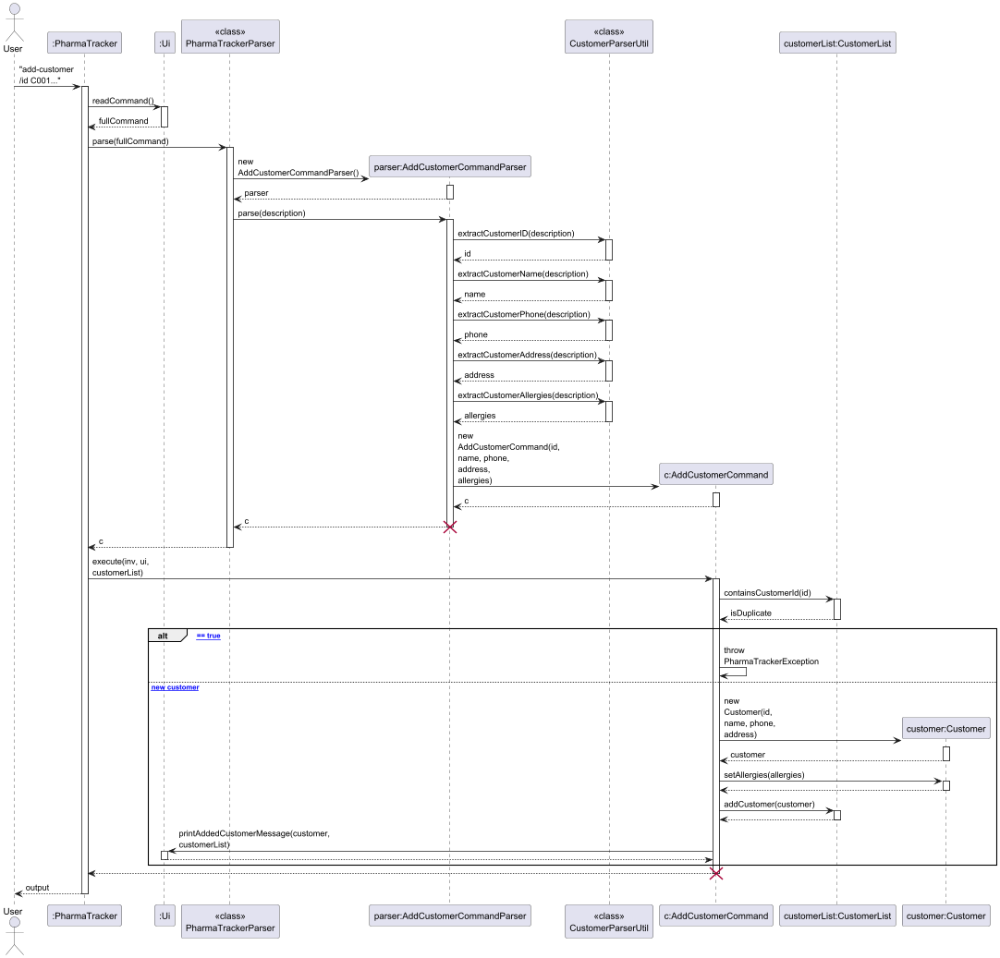

---

### List Customers Feature

The `list-customers` command retrieves and displays all registered customers with their
customer ID, name, and phone number. It is a read-only command that requires no arguments.

```
list-customers
```

#### How it works

1. The user enters `list-customers`.
2. `PharmaTracker.run()` reads the input and passes it to `Parser.parse()`.
3. `Parser.parse()` identifies the command word `list-customers` and returns a new
   `ListCustomersCommand` object — no arguments are required.
4. `PharmaTracker.run()` calls `ListCustomersCommand.execute()`, which calls
   `CustomerList.getAllCustomers()` to retrieve the full customer list.
5. The result is handled via an `alt` branch:
   - If the list is empty, `"No customers registered yet."` is printed and the command
     returns early.
   - Otherwise, each `Customer` is printed with a 1-based index, their customer ID,
     name, and phone number, followed by a total count.

The following sequence diagram shows the full execution flow of the `list-customers` command:


#### Design Considerations

| Aspect | Choice | Reason |
|--------|--------|--------|
| Formatting location | `ListCustomersCommand`, not `Customer.toString()` | Decouples display format from the model; output format can be changed without touching the data class |
| No arguments | None | Read-only query; the entire customer list is always shown |
| Empty-list guard in `execute()` | Yes | Produces a clear user-facing message rather than displaying an empty list silently |

---

### Restock Medication Feature

The `restock` command **additively** increases the stock of an existing medication by a
specified quantity. Unlike `update`, which overwrites the quantity field entirely, `restock`
tops up on top of the current stock level — matching the real-world behaviour of receiving
a new shipment.

```
restock INDEX /q QUANTITY
```

#### How it works

1. The user enters `restock 1 /q 50`.
2. `PharmaTracker.run()` passes the raw string to `Parser.parse()`.
3. `Parser.parse()` identifies the command word `restock`, then:
   - Extracts the integer index from the leading portion of the description.
   - Locates the `/q` flag and parses its value as a positive integer.
4. A new `RestockCommand(index, quantity)` object is constructed.
5. `PharmaTracker.run()` calls `RestockCommand.execute()`, which validates the index:
   - If the index is less than 1 or exceeds the inventory size, an error message is printed
     and the command returns early.
   - If the quantity is not a positive integer, an error message is printed and the command
     returns early.
6. For a valid index, `Inventory.getMedication(index - 1)` retrieves the target `Medication`.
7. `medication.setQuantity(medication.getQuantity() + quantity)` increments the existing stock.
8. `Ui` prints the confirmation message showing the medication name, units added, and updated
   stock total.

The following sequence diagram shows the full execution flow of the `restock` command:


#### Design Considerations

| Aspect | Choice | Reason |
|--------|--------|--------|
| Additive, not overwrite | Additive | Matches real-world shipment top-up behaviour; prevents accidental stock wipes |
| Separate from `update` | Yes | Makes intent explicit; avoids relying on users to do mental arithmetic before entering a quantity |
| Quantity validated as positive | Yes | A zero or negative restock quantity is semantically meaningless and is rejected early |
| Index validation in `execute()` | `execute()` | Index validity depends on the live `Inventory` size, which the stateless `Parser` does not hold |

---

### Dispense with Customer Linking Feature

Extends the existing `dispense` command with an optional `/c CUSTOMER_INDEX` flag. When the
flag is provided, the dispensed medication is recorded in that customer's dispensing history.
Omitting `/c` retains the original behaviour exactly — no customer data is read or written.

```
dispense INDEX q/QUANTITY [/c CUSTOMER_INDEX]
```

#### How it works

1. The user enters `dispense 1 q/20 /c 1` (or `dispense 1 q/20` without customer linking).
2. `PharmaTracker.run()` passes the raw string to `Parser.parse()`.
3. `Parser.parse()` identifies the command word `dispense`, then:
   - Extracts the medication index from the leading portion of the description.
   - Locates the `q/` flag and parses the quantity.
    - Checks for the optional `/c` flag. If present, its value is parsed as an integer
     `customerIndex`; if absent, the two-argument constructor is used, which internally
     sets `customerIndex` to the sentinel value `NO_CUSTOMER` (-1).
4. A `DispenseCommand` object is constructed via the appropriate constructor.
5. `PharmaTracker.run()` calls `DispenseCommand.execute()`, which performs the following
   validation before modifying any data:
   - If the medication index is out of range, an error is printed and the command returns early.
   - If the quantity exceeds current stock, an error is printed and the command returns early.
   - If `customerIndex != NO_CUSTOMER` and the customer index is out of range, an error is
     printed and the command returns early. Stock is **not** decremented in this case.
6. All validations passed: `medication.setQuantity(medication.getQuantity() - quantity)`
   decrements the stock.
7. If `customerIndex != NO_CUSTOMER`, `CustomerList.getCustomer(customerIndex - 1)` retrieves
   the target `Customer`, and `customer.addDispensingHistory(record)` appends the dispense
   record to their history.
8. `Ui` prints the confirmation message. If a customer was linked, the output includes the
   customer's ID and name.

The following sequence diagram shows the full execution flow of `dispense` with customer
linking. The `[c/ flag present]` alt branch is only entered when a customer index is supplied:

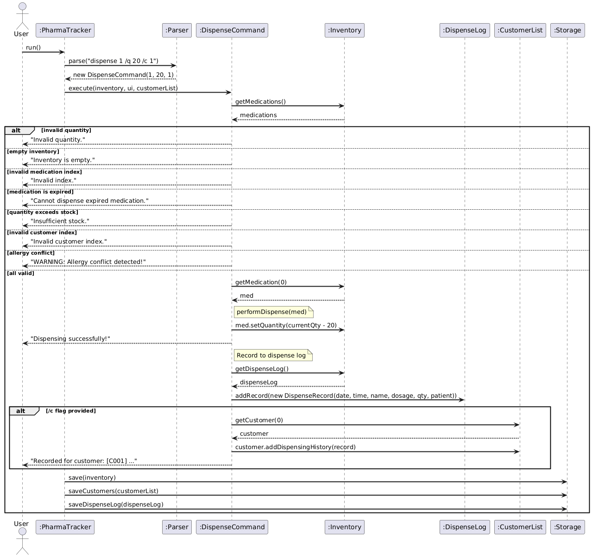

#### Design Considerations

| Aspect | Choice | Reason |
|--------|--------|--------|
| Optional `c/` flag vs a separate command | Optional flag on existing command | Avoids duplicating stock-decrement logic; fully backward compatible — existing calls without `c/` are unaffected |
| Sentinel value `NO_CUSTOMER = -1` | Sentinel (`int`) over `Integer` / `null` | Avoids autoboxing and null-pointer risk on a primitive field; the sentinel is a named constant and self-documenting |
| Customer index validated **before** stock decrement | Pre-decrement guard | Prevents a state where stock is already reduced but the customer record write then fails |
| Dispensing record stored on `Customer`, not `Medication` | `Customer` | The natural query is "what has this customer received?"; storing on `Medication` would require scanning every medication to reconstruct a customer's history |
| Two constructors (2-arg and 3-arg) | Overloaded constructors | Keeps call sites for the no-customer case clean; the 2-arg constructor delegates to the 3-arg one via `this(index, quantity, NO_CUSTOMER)` |

---

### Find Customer Feature

The `find-customer` command searches the customer list for customers whose names contain a given
keyword. The search is case-insensitive and supports partial matches.
```
find-customer KEYWORD
```

#### How it works

1. The user enters `find-customer alice`.
2. `PharmaTracker.run()` reads the user input and passes the raw string to `Parser.parse()`.
3. `Parser.parse()` identifies the command word `find-customer` and extracts the remainder of
   the input as the search keyword. If the keyword is empty, an error message is printed and
   no command is returned.
4. A new `FindCustomerCommand(keyword)` object is constructed with the extracted keyword.
5. `PharmaTracker.run()` calls `FindCustomerCommand.execute()`, which retrieves all customers
   from `CustomerList`.
6. The command iterates over every `Customer`, calling `getName()` on each one. If the name
   contains the keyword (case-insensitive), the customer is added to a `matchingCustomers` list.
7. After the loop, the result is handled via an `alt` branch:
    - If `matchingCustomers` is empty, a `"No customers found matching: ..."` message is printed
      and the command returns early.
    - Otherwise, the matching customers are printed as a numbered list showing each customer's
      ID, name, and phone number.

The following sequence diagram shows the full execution flow of the `find-customer` command:

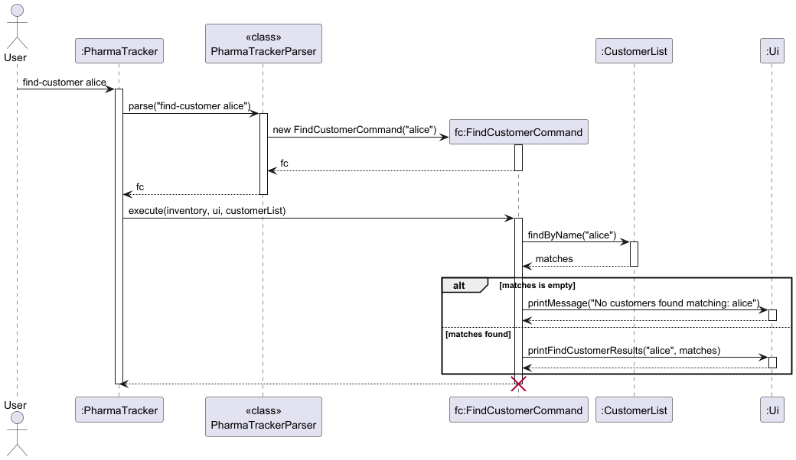

#### Design Considerations

| Aspect | Choice | Reason |
|--------|--------|--------|
| Case-insensitive matching | `toLowerCase()` on both sides | Reduces user friction; staff should not need to remember the exact capitalisation of a customer's name |
| Partial match via `contains()` | Yes | A keyword like `Ali` usefully returns `Alice`; exact-match would be too restrictive for quick lookups |
| Search on name only | Name field | Names are the primary lookup key in a pharmacy context; searching across all fields (e.g. phone, address) would produce unintuitive results |
| Empty keyword handled in `Parser` | `Parser` | Fails fast before a command object is created; consistent with how other commands with mandatory arguments are validated |

---

### View Customer Feature

The `view-customer` command allows pharmacy staff to retrieve and display the full profile of a
specific customer, including their ID, name, phone number, address, and complete dispensing history.
```
view-customer INDEX
```

#### How it works

1. The user enters `view-customer 1`.
2. `PharmaTracker.run()` reads the user input and passes the raw string to `Parser.parse()`.
3. `Parser.parse()` identifies the command word `view-customer` and extracts the integer index
   from the remainder of the input string.
4. The extracted index is used to construct a new `ViewCustomerCommand` object.
5. `PharmaTracker.run()` calls `ViewCustomerCommand.execute()`, which first checks
   `CustomerList.size()` to validate the request:
   - If the customer list is empty, `"No customers registered yet."` is printed directly and
     the command returns early.
   - If the index is out of range (less than 1 or greater than list size), an invalid-index
     error message is printed and the command returns early.
6. For a valid index, `CustomerList.getCustomer(index - 1)` retrieves the target `Customer` object.
7. Finally, `Ui.showCustomerDetails(customer)` is called to display the customer's full details,
   including their dispensing history (or a `"No medications dispensed yet."` message if the
   history is empty).

The following sequence diagram shows the full execution flow of the `view-customer` command:

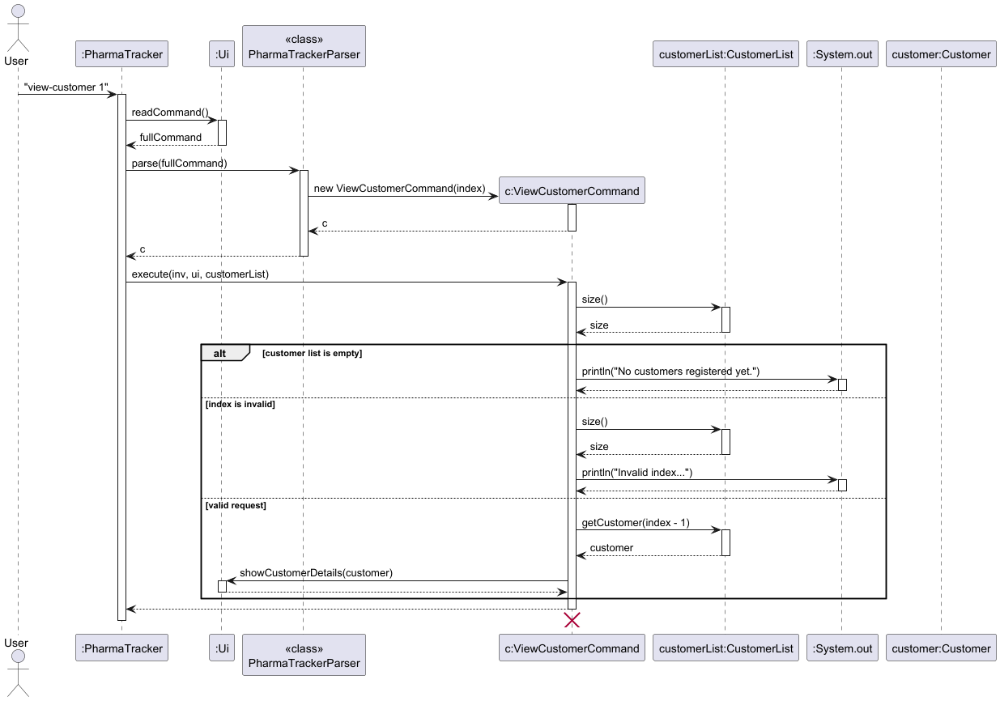

#### Design Considerations

| Aspect | Choice | Reason |
|--------|--------|--------|
| Index validation in `execute()`, not `Parser` | `execute()` | Index validity depends on the live `CustomerList` size, which the stateless parser does not hold |
| Two-stage guard (empty list, then out-of-range) | Yes | Produces a clearer error message; avoids an `IndexOutOfBoundsException` when the list is empty |
| Display delegated to `Ui.showCustomerDetails()` | `Ui` | Keeps display logic out of the command class; consistent with the SRP enforced across the codebase |

---

### Update Customer Feature

The `update-customer` command allows pharmacy staff to update one or more fields of an existing customer record.
Only the fields explicitly provided are changed; all other fields remain unchanged.
```
update-customer INDEX [/n NAME] [/p PHONE] [/a ADDRESS]
```

#### How it works

1. The user enters `update-customer 1 /n Alice /p 91234567 /a 123 Main St`.
2. `PharmaTracker.run()` passes the input to `Parser.parse()`.
3. `Parser.parse()` identifies the command word `update-customer`.
4. The parser splits the description into the 1-based index and a trailing argument string. It then calls `extractCustomerUpdateFlag()` for each of the `/n`, `/p`, and `/a` flags. Flags that are absent return `null`.
5. An `UpdateCustomerCommand` is constructed with the index and the three (nullable) field values.
6. `UpdateCustomerCommand.execute()` validates the index against `CustomerList.size()`. If no flags were supplied (all three are `null`), it prints an error and returns early.
7. For each non-null field, the corresponding setter (`customer.setName()`, `customer.setPhone()`, `customer.setAddress()`) is called on the retrieved `Customer` object.
8. `Ui.printUpdatedCustomerMessage(customer)` confirms the update to the user.

The following sequence diagram shows the full execution flow of the `update-customer` command:


#### Design Considerations

| Aspect | Choice | Reason |
|--------|--------|--------|
| `null` for absent flags | Yes | Cleanly distinguishes "not provided" from an empty string; avoids silent overwrites |
| Partial update vs full replacement | Partial | Users should not have to re-enter unchanged fields |
| Validation location | `execute()`, not `Parser` | Keeps parser stateless; index validity requires live `CustomerList` size |

---

### Sort Medication Feature

The `sort` command sorts all medications in the inventory by expiry date in ascending order,
placing the soonest-expiring items first. Medications with invalid or unparseable expiry dates
are treated as having the furthest possible expiry date and appear last.
```
sort
```

#### How it works

1. The user enters `sort`.
2. `PharmaTracker.run()` reads the input and passes it to `Parser.parse()`.
3. `Parser.parse()` identifies the command word `sort` and returns a new `SortCommand` object — no arguments are required.
4. `PharmaTracker.run()` calls `SortCommand.execute()`, which retrieves the medication list from `Inventory.getMedications()`.
5. If the list is empty, `"Inventory is empty."` is printed and the command returns early.
6. Otherwise, the list is sorted in-place using `ArrayList.sort()` with a custom `Comparator`. For each medication, `getExpiryDate()` is retrieved and parsed using two formatters (`yyyy-MM-dd` then `dd/MM/yyyy`). If both fail, `LocalDate.MAX` is used as a fallback.
7. The sorted list is printed to the console with 1-based indices.

The following sequence diagram shows the full execution flow of the `sort` command:

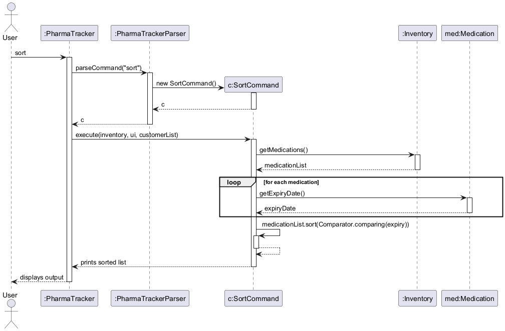

#### Design Considerations

| Aspect | Choice | Reason |
|--------|--------|--------|
| Sort in-place | Yes | Mutates the `Inventory` directly; sort order is preserved for subsequent `list` calls |
| `LocalDate.MAX` fallback for bad dates | Yes | Keeps bad-data records at the end without crashing; staff can then inspect and fix them |
| No arguments | None | Sorting always operates on the full inventory; no filtering is needed |
| Direct `System.out` output | `System.out` in command | The sort result is a full list render; a dedicated `Ui` method would be added if richer formatting is ever needed |

---

### Low Stock Feature

The `lowstock` command displays all medications whose quantity falls below a threshold.
The default threshold is **20 units**, and an optional `/threshold` flag lets users specify a custom value.
```
lowstock [/threshold NUMBER]
```

#### How it works

1. The user enters `lowstock` or `lowstock /threshold 10`.
2. `PharmaTracker.run()` passes the input to `Parser.parse()`.
3. `Parser.parse()` identifies the command word `lowstock`. If the `/threshold` flag is present, its integer value is parsed; otherwise `LowStockCommand.DEFAULT_THRESHOLD` (20) is used.
4. A `LowStockCommand` object is created with the resolved threshold.
5. `LowStockCommand.execute()` iterates over every `Medication` in the `Inventory`. Any medication whose `quantity < threshold` is collected into a list.
6. `Ui.printLowStockList(lowStockMeds, threshold)` displays the filtered list with the active threshold, or a message stating all stock is sufficient.

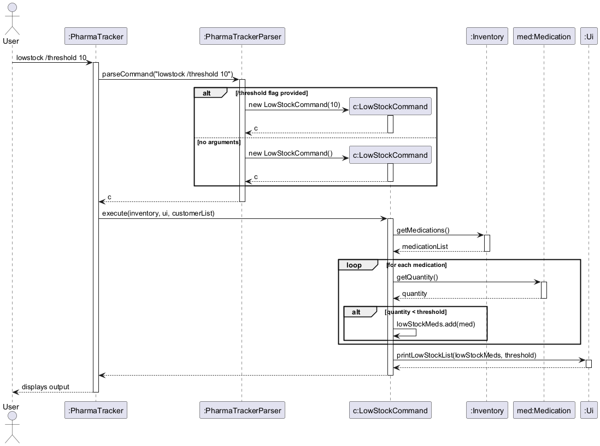

#### Design Considerations

| Aspect | Choice | Reason |
|--------|--------|--------|
| Default threshold of 20 | `DEFAULT_THRESHOLD` constant | Provides a sensible out-of-the-box value without requiring user input |
| Strict `<` vs `<=` | `<` (strict less-than) | A medication at exactly the threshold is considered adequately stocked |
| Optional `/threshold` flag | Optional | Keeps the command simple for common use while supporting custom thresholds |

---

### Expiring Medications Feature

The `expiring` command scans the inventory and reports medications that have already passed their
expiry date, as well as those expiring within a configurable number of days. It defaults to a
30-day window if no argument is provided.
```
expiring [/days DAYS]
```

#### How it works

1. The user enters `expiring /days 14` (or just `expiring`).
2. `PharmaTracker.run()` reads the user input and passes the raw string to `Parser.parse()`.
3. `Parser.parse()` identifies the command word `expiring` and checks for the optional `/days` flag:
   - If `/days` is **absent**, a default `ExpiringCommand` is constructed using the no-argument
     constructor, which sets the window to `DEFAULT_DAYS` (30).
   - If `/days` is **present**, the parser calls `parseInt()` on the extracted value to obtain the
     number of days, then constructs `ExpiringCommand(days)` with that value.
4. `PharmaTracker.run()` calls `ExpiringCommand.execute()`, which calls
   `Inventory.getMedications()` to obtain the full medication list.
5. The command iterates over every `Medication`. For each one, `getExpiryDate()` is called:
   - If the expiry date is `null` or cannot be parsed, the medication is **skipped**.
   - If the expiry date is **before today**, the medication is added to `expiredMeds`.
   - If the expiry date falls **within the cutoff window** (today through today + days), the
     medication is added to `expiringMeds`.
6. `Ui.showExpiringMedications(expiredMeds, expiringMeds, days)` is called to display the
   results. If both lists are empty, a single `"No expired or expiring medications found."` message
   is shown. Otherwise, expired and soon-to-expire medications are displayed in two labelled sections.

The following sequence diagram shows the full execution flow of the `expiring` command:

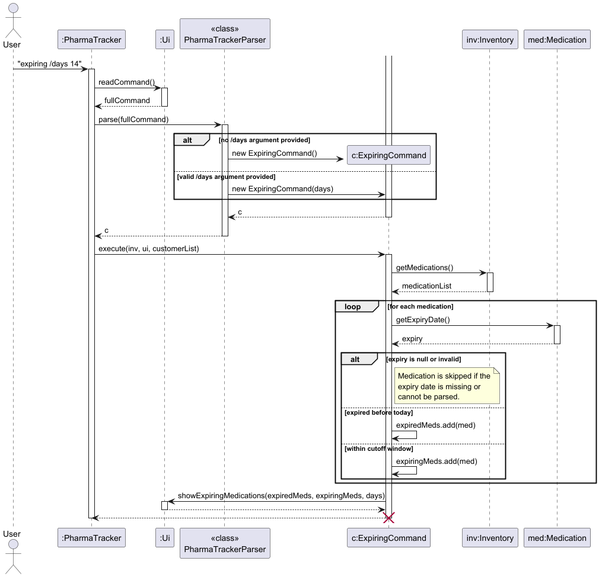

#### Design Considerations

| Aspect | Choice | Reason |
|--------|--------|--------|
| Default window of 30 days | `DEFAULT_DAYS` constant | Provides a sensible out-of-the-box value; avoids requiring user input for the common case |
| Skip medications with unparseable expiry | Silent skip | Prevents a single bad record from crashing the entire scan; logged for debugging |
| Two separate result lists (`expiredMeds`, `expiringMeds`) | Yes | Allows the `Ui` to present expired and soon-to-expire items in clearly labelled sections, giving staff immediately actionable information |
| Display delegated to `Ui.showExpiringMedications()` | `Ui` | Consistent with SRP; the command handles filtering logic only and hands display responsibility to `Ui` |

---

### Label Feature

The `label` command generates a printable medication label for a specific medication in the
inventory, identified by its 1-based index. The label displays the medication's name, dosage,
expiry date, and tag (if present).
```
label INDEX
```

#### How it works

1. The user enters `label 1`.
2. `PharmaTracker.run()` reads the input and passes it to `Parser.parse()`.
3. `Parser.parse()` identifies the command word `label` and parses the description as an integer index.
4. A new `LabelCommand(index)` object is constructed.
5. `PharmaTracker.run()` calls `LabelCommand.execute()`, which first validates:
   - If the inventory is empty, `"Inventory is empty."` is printed and the command returns early.
   - If the index is less than 1 or greater than the inventory size, an invalid-index error is printed and the command returns early.
6. For a valid index, `Inventory.getMedication(index - 1)` retrieves the target `Medication`.
7. A formatted label block is printed showing the medication's name, dosage, expiry date, and tag. The tag line is omitted if the tag is empty or `null`.

The following sequence diagram shows the full execution flow of the `label` command:

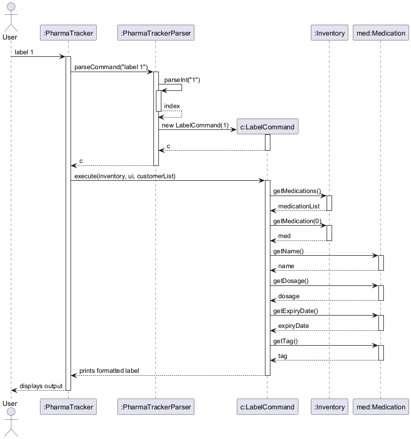

#### Design Considerations

| Aspect | Choice | Reason |
|--------|--------|--------|
| Tag line omitted when empty | Yes | A blank tag line on a physical label looks unprofessional and adds no information |
| Two-stage guard (empty inventory, then out-of-range) | Yes | Produces a clearer error message; avoids an `IndexOutOfBoundsException` when the list is empty |
| Direct `System.out` for label body | `System.out` in command | The label block is self-contained formatting; moving it to `Ui` would offer no architectural benefit for a single-command output |

---

### Daily Dispense Log Feature

The `dispenselog` command displays a summary of all medications dispensed on a given date.
Every time a `dispense` command succeeds, a `DispenseRecord` is automatically appended to
the `DispenseLog` held inside `Inventory`. The log is persisted to `data/dispense_log.txt`
across sessions.

```
dispenselog [/date YYYY-MM-DD]
```

#### How it works

1. **Recording (happens on every successful `dispense`):**
   - After `DispenseCommand.performDispense()` reduces the stock, a `DispenseRecord` is
     constructed with the current `LocalDate`, `LocalTime`, medication name, dosage,
     quantity dispensed, and the linked customer's name (empty string if none).
   - The record is appended to `inventory.getDispenseLog()` via `DispenseLog.addRecord()`.
   - `PharmaTracker.run()` then calls `Storage.saveDispenseLog()`, which serialises every
     record in the log to `data/dispense_log.txt` (one pipe-delimited line per record).

2. **Viewing (`dispenselog` command):**
   1. The user enters `dispenselog` (today) or `dispenselog /date 2026-04-09` (specific date).
   2. `PharmaTracker.run()` passes the input to `Parser.parse()`.
   3. `Parser.parse()` identifies the command word `dispenselog`:
      - If no argument is given, a `DispenseSummaryCommand()` is constructed (defaults to `LocalDate.now()`).
      - If `/date YYYY-MM-DD` is present, `LocalDate.parse(dateStr)` is called and the result
        is passed to `DispenseSummaryCommand(date)`.
   4. `PharmaTracker.run()` calls `DispenseSummaryCommand.execute()`, which calls
      `inventory.getDispenseLog().getRecordsByDate(date)` to filter records.
   5. The filtered list (and the target date) are passed to `Ui.printDispenseSummary()`,
      which prints each record with a 1-based index, timestamp, medication name, dosage,
      quantity, and patient name (if any), plus a totals line at the bottom.

3. **Loading on startup:**
   - `PharmaTracker()` calls `Storage.loadDispenseLog()`, which reads `data/dispense_log.txt`
     line-by-line using `DispenseRecord.fromStorageString()` and reconstructs a `DispenseLog`.
   - The loaded log is installed into `Inventory` via `inventory.setDispenseLog(log)`.

#### Class overview

| Class | Role |
|---|---|
| `DispenseRecord` | Immutable value object for one dispense event (date, time, med name, dosage, qty, patient) |
| `DispenseLog` | Wrapper around `ArrayList<DispenseRecord>`; provides `getRecordsByDate()` for filtering |
| `DispenseSummaryCommand` | Command class; retrieves filtered records and delegates display to `Ui` |
| `Inventory` | Holds the `DispenseLog` field; exposes `getDispenseLog()` / `setDispenseLog()` |
| `Storage` | `saveDispenseLog()` / `loadDispenseLog()` for file persistence |
| `Ui` | `printDispenseSummary(date, records)` for formatted console output |

#### Design Considerations

| Aspect | Choice | Reason |
|--------|--------|---------|
| Log stored inside `Inventory` | `Inventory` field | `Inventory` is already the single source of truth for all medication-related data; avoids passing a separate `DispenseLog` object through every command's `execute()` signature |
| Append only `DispenseRecord` after success | Post-`performDispense()` hook | Ensures only verified dispense events are recorded; a rejected dispense (invalid index, insufficient stock) produces no record |
| Persistence in a separate file (`dispense_log.txt`) | Separate file | Decouples the fast-changing log from the slower-changing inventory snapshot; makes it easy to archive or clear logs independently |
| `DispenseRecord.fromStorageString()` returns `null` on error | Null return, not exception | Lets `loadDispenseLog()` skip corrupted lines with a warning rather than aborting the entire load |
| Date filter via `Stream.filter()` in `DispenseLog` | Stream | Concise and easy to extend (e.g. date-range queries) without changing the storage format |
| Default to today in `DispenseSummaryCommand()` | `LocalDate.now()` | Most common use-case; staff checking end-of-day totals should not need to type a date |

The following sequence diagrams show the two flows of the dispense log feature.

**Recording flow** — how a `dispense` command writes to the log and saves it:


**Viewing flow** — how `dispenselog` loads, filters, and displays records:

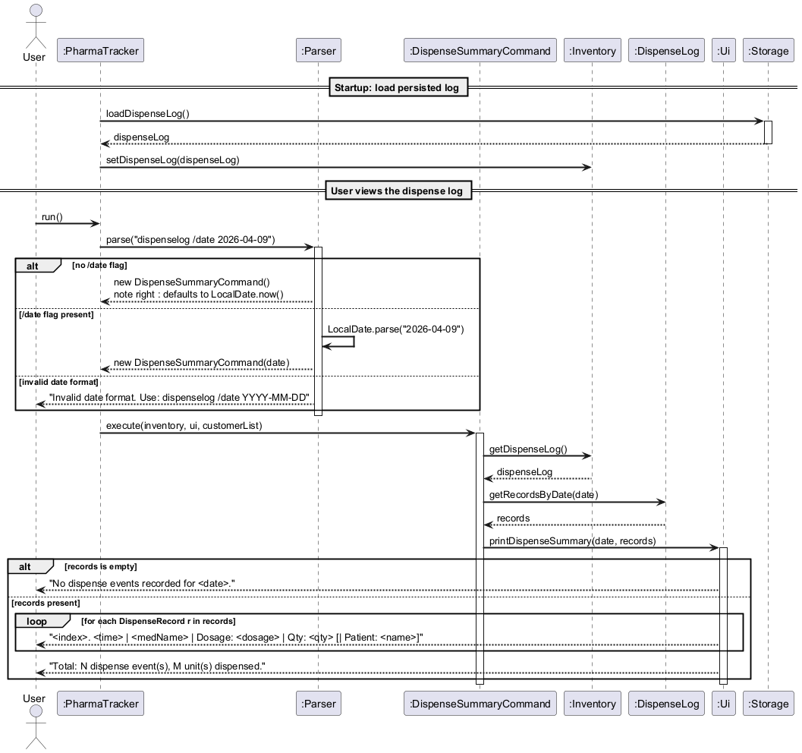

---

### User Authentication Feature

PharmaTracker includes account-based access control so users must authenticate before executing
most commands.

```
register USERNAME /p PASSWORD
login USERNAME /p PASSWORD
logout
```

#### How it works

1. On startup, `PharmaTracker()` loads persisted users and previous session state from `Storage`.
2. `AuthService` is initialized and registered in `AppServices` for command access.
3. During command loop execution, `PharmaTracker.run()` checks:
   - If `command.requiresAuthentication()` is `true` and there is no active session,
     execution is blocked with an authentication-required message.
4. `RegisterCommand` and `LoginCommand` parse `USERNAME /p PASSWORD` and call
   `AuthService.register()` / `AuthService.login()`.
5. `LogoutCommand` clears the active session via `AuthService.logout()`.
6. After each command cycle, users and session are persisted with
   `storage.saveUsers(...)` and `storage.saveSession(...)`.

#### Design Considerations

| Aspect | Choice | Reason |
|--------|--------|--------|
| Auth enforcement point | `PharmaTracker.run()` gate using `requiresAuthentication()` | Centralized enforcement avoids duplicated checks in every command class |
| Default command auth policy | `Command.requiresAuthentication()` returns `true` | Secure-by-default; only selected commands override to allow unauthenticated usage |
| Session persistence | Save current username after each command | Supports session restoration and avoids forcing login after every restart |

---

### Auto Restock Alerts Feature

The system automatically monitors inventory stock levels against per-medication thresholds and
surfaces actionable restock alerts.

```
set-threshold INDEX /threshold NUMBER
alerts
ack-alert ALERT_INDEX
alert-history
```

#### How it works

1. Every medication has `minimumStockThreshold`, initialized to a default value.
2. Users can override it with `SetThresholdCommand` using
   `set-threshold INDEX /threshold NUMBER`.
3. `PharmaTracker.run()` calls `restockAlertService.evaluateInventory(inventory)`:
   - On startup.
   - After every command except `logout`.
4. `RestockAlertService` compares each medication's quantity against threshold:
   - If `quantity < threshold`, an active alert is created/updated.
   - If stock recovers above threshold, existing active alert is auto-resolved.
5. `alerts` prints currently active alerts.
6. `ack-alert ALERT_INDEX` acknowledges one active alert by display index.
7. `alert-history` shows full persisted alert history.
8. Alert history is saved via `storage.saveAlertHistory(...)` each cycle.

#### Design Considerations

| Aspect | Choice | Reason |
|--------|--------|--------|
| Per-medication threshold | Stored on `Medication` | Flexible and realistic; different medications can have different reorder points |
| Active + history model | Active map plus append-only history list | Enables operational view (`alerts`) and audit trail (`alert-history`) |
| Automatic evaluation in main loop | Re-evaluate after command execution | Keeps alerts up-to-date without requiring users to trigger a separate scan command |

---

### Management of Customers

This foundational data layer serves as the storage and management backbone for all patient-centric features.

#### Implementation

It is composed of two primary classes:
1.  **`Customer` Model**: Encapsulates clinical and contact data including a unique ID, name, phone, and optional address. It maintains an `ArrayList<String>` designated as `dispensingHistory` which acts as a clinical audit trail.
2.  **`CustomerList` Manager**: This class wraps an `ArrayList<Customer>` and provides methods for data manipulation, such as `addCustomer()`, `deleteCustomer()`, and `findByName()`.

The following class diagrams illustrates the relationship between the management logic and the data model:

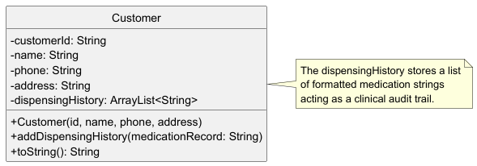


#### Why it is implemented that way

* **Encapsulation**: Using a manager class (`CustomerList`) protects the internal list from direct modification and allows for unified index validation across the application.
* **Single Responsibility Principle**: Separating the data model from the collection logic ensures the code is modular and easier to maintain.

#### Alternatives Considered

* **Unified Inventory**: Storing patients inside the `Inventory` class was rejected to avoid a "God Class" anti-pattern. Keeping them separate makes the code easier to debug and scale.

## Product scope

### Target user profile

Pharmacy staff (pharmacists, pharmacy technicians) who:
- Need to manage a medication inventory in a small to mid-size pharmacy
- Prefer a fast CLI-based workflow over GUI applications
- Are comfortable typing commands and can type quickly
- Need to track medication stock, expiry dates, and dispensing

### Value proposition

Fast, lightweight medication tracking without needing a database or internet connection

## User Stories

| Version | As a ...            | I want to ...                          | So that I can ...                                  |
|---------|---------------------|----------------------------------------|----------------------------------------------------|
| v1.0    | new user            | see usage instructions                 | refer to them when I forget how to use the app     |
| v1.0    | pharmacist          | add medications to inventory           | track stock levels                                 |
| v1.0    | pharmacist          | list all medications                   | see what is currently in stock                     |
| v1.0    | pharmacist          | delete a medication                    | remove discontinued or incorrect entries           |
| v1.0    | pharmacist          | find medication by keyword             | quickly locate a specific drug without scrolling   |
| v1.0    | pharmacist          | sort medications by expiry date        | identify medications expiring soon                 |
| v1.0    | pharmacist          | view detailed medication information   | check dosage form, directions, and warnings        |
| v2.0    | pharmacist          | print a medication label               | attach it to dispensed packages                    |
| v2.0    | pharmacist          | view all registered customers          | reference their details quickly                    |
| v2.0    | pharmacist          | restock a medication                   | top up stock when a new shipment arrives           |
| v2.0    | pharmacist          | link a dispense event to a customer    | maintain each customer's medication history        |
| v2.0    | pharmacist          | update a customer's details            | keep customer records current and accurate         |
| v2.0    | pharmacist          | check which medications are low stock  | reorder before supplies run out                    |
| v2.0.1    | pharmacist          | view a daily dispense log              | review or audit all dispensing events for any date |
| v2.1    | pharmacist          | register and login                     | protect sensitive inventory and customer workflows |
| v2.1    | pharmacist          | configure restock thresholds and review alerts | proactively restock medications before stockouts |

## Non-Functional Requirements

{Give non-functional requirements}

## Glossary

* *glossary item* - Definition

## Instructions for manual testing

{Give instructions on how to do a manual product testing e.g., how to load sample data to be used for testing}

### Launching the application

1. Open a terminal in the project root directory.
2. Run `./gradlew run` (Linux/macOS) or `.\gradlew run` (Windows).
3. The welcome banner and `Enter command:` prompt should appear.

### Adding a medication

1. Enter: `add /n Paracetamol /d 500mg /q 100 /e 2026-12-31 /t painkiller`
2. **Expected:** Confirmation message showing the medication was added.
3. With optional fields: `add /n Amoxicillin /d 250mg /q 50 /e 2026-06-01 /t antibiotic /df Capsule /mfr Pfizer /warn "May cause allergic reactions"`

### Listing medications

1. Enter: `list`
2. **Expected:** All medications displayed with index, name, dosage, quantity, expiry, and tag. Items with quantity ≤ 10 show `[LOW STOCK]`.

### Finding a medication

1. Enter: `find Paracetamol`
2. **Expected:** All medications whose name contains "Paracetamol" (case-insensitive) are listed.

### Listing customers

1. Enter: `list-customers`
2. **Expected (with customers):** Numbered list showing `[C001] John Tan | Phone: 99887766`, followed by total count.
3. **Expected (no customers):** `No customers registered yet.`

### Restocking a medication

1. Enter: `restock 1 /q 50`
2. **Expected:** Confirmation showing medication name, units added, and updated stock total.
3. Invalid index: `restock 99 /q 50` → error message for out-of-bounds index.
4. Invalid quantity: `restock 1 /q -10` → error message for non-positive quantity.

### Dispensing with customer linking

1. Enter: `dispense 1 q/20 /c 1`
2. **Expected:** Stock reduced by 20, confirmation includes customer ID and name.
3. Without customer: `dispense 1 q/20` → behaves as original, no customer info in output.
4. Invalid customer index: `dispense 1 q/20 /c 99` → error message for out-of-bounds customer index.

### Updating a customer

1. Enter: `update-customer 1 /n Alice Tan /p 91234567`
2. **Expected:** Confirmation showing updated customer details; address is unchanged.
3. All fields: `update-customer 1 /n Alice Tan /p 91234567 /a 10 Orchard Road` → all three fields updated.
4. No flags supplied: `update-customer 1` → error `No fields provided to update! Use /n, /p, or /a flags.`
5. Invalid index: `update-customer 99 /n Alice` → error message for out-of-bounds index.

### Checking low stock

1. Enter: `lowstock`
2. **Expected:** All medications with quantity below 20 (default threshold) are listed with their name, dosage, quantity, and expiry.
3. Custom threshold: `lowstock /threshold 10` → lists medications with quantity below 10.
4. No low-stock items: a message stating all medications are sufficiently stocked is shown.
5. Invalid threshold: `lowstock /threshold abc` → error message for non-integer threshold.

### Viewing the daily dispense log

1. Dispense some medications first: `dispense 1 q/5` and `dispense 2 q/3`.
2. Enter: `dispenselog`
3. **Expected:** A log showing today's date, one entry per dispense event with time, medication name, dosage, quantity, and patient name (if linked). A totals line at the bottom shows event count and total units.
4. With a patient: `dispense 1 q/2 /c 1` then `dispenselog` → the patient's name appears on that entry.
5. Specific past date: `dispenselog /date 2026-01-01` → `No dispense events recorded for 2026-01-01.` (assuming no events on that date).
6. Invalid date format: `dispenselog /date 09-04-2026` → error message asking for `YYYY-MM-DD` format.
