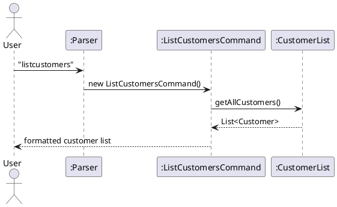
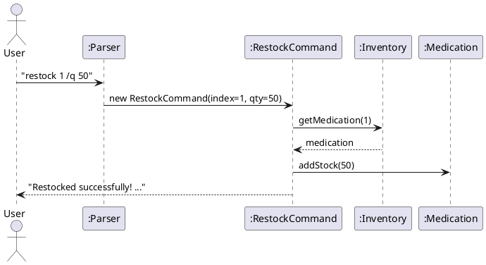
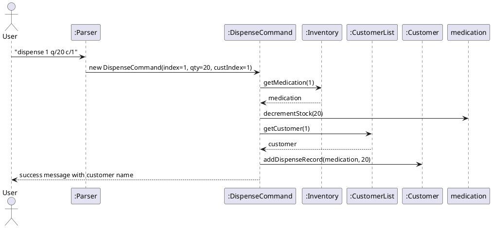

# Developer Guide

## Acknowledgements

Beyond the Java Standard Library, no other libraries were used. No code was reused as well.

## Setting up, getting started

{Update with instructions on setting up}

## Design

### Architecture

### UI Component

{Update with information about UI Architecture}

### Command Component

{Update with information about Command Architecture}

### Parser Component

{Update with information about Parser Architecture}

### Storage Component

{Update with information about Storage Component}

## Implementation

This section describes some noteworthy details on how certain features are implemented.

### Add Medication Feature

This add-medication mechanism allows users to record a new medication
with the name, dosage, quantity and expiry date information.
```
add /n NAME /d DOSAGE /q QUANTITY /e EXPIRY [/t TAG]
```
#### How it works

The following steps describe how an add command is processed.

1. The user enters `add /n Paracetamol /d 500mg /q 100 /e 2026-12-31 /t Painkiller`.
2. `PharmaTracker.run()` reads the user input and passes the raw string to `Parser.parse()`.
3. `Parser.parse()` identifies the command word `add`.
4. The parser then delegates the specific extract methods
   (such as `extractName()`, `extractDosage()`, `extractQuantity` and `extractExpiryDate()`).
   These methods locate the corresponding flag prefixes (e.g. `/n`, `/d`, `/q`, `/e`) using string indexing to extract the arguments.
   Optional flags are extracted using `extractFlag()` or `extractWarnings()`.
5. The extracted values are used to create a new `AddCommand` object.
6. `PharmaTracker.run()` calls `AddCommand.execute()`, which creates a new `Medication` object and adds it to the `Inventory`.
7. Finally, `Ui.printAddedMessage()` is called to display a confirmation message to the user.

---

### List Customers Feature

The `listcustomers` command retrieves and displays all registered customers with their ID, name, and phone number.
```
listcustomers
```

#### How it works

1. The user enters `listcustomers`.
2. `PharmaTracker.run()` passes the input to `Parser.parse()`.
3. `Parser.parse()` identifies the command word `listcustomers` and returns a `ListCustomersCommand` object (no arguments needed).
4. `PharmaTracker.run()` calls `ListCustomersCommand.execute()`, which calls `CustomerList.getAllCustomers()`.
5. If the list is empty, `Ui` displays `No customers registered yet.`
6. Otherwise, each `Customer` is printed with their ID, name, and phone number, followed by a total count.

#### Sequence Diagram



#### Design Considerations

| Aspect | Choice | Reason |
|--------|--------|--------|
| Formatting location | `ListCustomersCommand`, not `Customer.toString()` | Decouples display format from model; easier to change output later |
| Parameters | None | Read-only command; no input needed |

---

### Restock Medication Feature

The `restock` command **additively** increases the stock of an existing medication. Unlike `update` which overwrites, `restock` tops up on top of the current quantity.
```
restock INDEX /q QUANTITY
```

#### How it works

1. The user enters `restock 1 /q 50`.
2. `Parser.parse()` identifies `restock`, extracts the index and `/q` quantity.
3. A `RestockCommand` object is created with the index and quantity.
4. `RestockCommand.execute()` retrieves the `Medication` at the given index from `Inventory`.
5. `medication.addStock(quantity)` is called to increment the existing stock.
6. `Ui` confirms with the medication name, added units, and updated stock total.

#### Sequence Diagram



#### Design Considerations

| Aspect | Choice | Reason |
|--------|--------|--------|
| Separate from `update` | Yes | Prevents accidental overwrite during restocking; makes intent explicit |
| Additive vs overwrite | Additive | Matches real-world shipment top-up behaviour |

---

### Dispense with Customer Linking Feature

Extends the existing `dispense` command with an optional `c/CUSTOMER_INDEX` flag. When provided, the dispensed medication is recorded into that customer's dispensing history. Omitting `/c` retains the original behaviour exactly.
```
dispense INDEX q/QUANTITY [c/CUSTOMER_INDEX]
```

#### How it works

1. The user enters `dispense 1 q/20 c/1`.
2. `Parser.parse()` identifies `dispense`, extracts the medication index, `q/` quantity, and optionally `c/` customer index.
3. A `DispenseCommand` is constructed with `customerIndex` set to `1` (or `null` if `/c` is omitted).
4. `DispenseCommand.execute()`:
   - Retrieves the medication from `Inventory` and decrements stock unconditionally.
   - If `customerIndex` is non-null, retrieves the `Customer` from `CustomerList` and calls `customer.addDispenseRecord(medication, quantity)`.
5. `Ui` confirms with medication name, amount, updated stock, and customer name if linked.

#### Sequence Diagram



#### Design Considerations

| Aspect | Choice | Reason |
|--------|--------|--------|
| Optional `/c` flag vs separate command | Optional flag | Avoids duplicating stock-decrement logic; backward compatible |
| Record stored in `Customer` vs `Medication` | `Customer` | Querying a customer's full history is natural; avoids scanning all medications |
| `null` for absent customer | `null` check before lookup | Clean guard; no dummy customer object needed |

---

## Product scope

### Target user profile

Pharmacy staff (pharmacists, pharmacy technicians) who:
- Need to manage a medication inventory in a small to mid-size pharmacy
- Prefer a fast CLI-based workflow over GUI applications
- Are comfortable typing commands and can type quickly
- Need to track medication stock, expiry dates, and dispensing

### Value proposition

Fast, lightweight medication tracking without needing a database or internet connection

## User Stories

| Version | As a ...            | I want to ...                          | So that I can ...                                  |
|---------|---------------------|----------------------------------------|----------------------------------------------------|
| v1.0    | new user            | see usage instructions                 | refer to them when I forget how to use the app     |
| v1.0    | pharmacist          | add medications to inventory           | track stock levels                                 |
| v1.0    | pharmacist          | list all medications                   | see what is currently in stock                     |
| v1.0    | pharmacist          | delete a medication                    | remove discontinued or incorrect entries           |
| v1.0    | pharmacist          | find medication by keyword             | quickly locate a specific drug without scrolling   |
| v1.0    | pharmacist          | sort medications by expiry date        | identify medications expiring soon                 |
| v1.0    | pharmacist          | view detailed medication information   | check dosage form, directions, and warnings        |
| v2.0    | pharmacist          | print a medication label               | attach it to dispensed packages                    |
| v2.0    | pharmacist          | view all registered customers          | reference their details quickly                    |
| v2.0    | pharmacist          | restock a medication                   | top up stock when a new shipment arrives           |
| v2.0    | pharmacist          | link a dispense event to a customer    | maintain each customer's medication history        |

## Non-Functional Requirements

{Give non-functional requirements}

## Glossary

* *glossary item* - Definition

## Instructions for manual testing

{Give instructions on how to do a manual product testing e.g., how to load sample data to be used for testing}

### Launching the application

1. Open a terminal in the project root directory.
2. Run `./gradlew run` (Linux/macOS) or `.\gradlew run` (Windows).
3. The welcome banner and `Enter command:` prompt should appear.

### Adding a medication

1. Enter: `add /n Paracetamol /d 500mg /q 100 /e 2026-12-31 /t painkiller`
2. **Expected:** Confirmation message showing the medication was added.
3. With optional fields: `add /n Amoxicillin /d 250mg /q 50 /e 2026-06-01 /t antibiotic /df Capsule /mfr Pfizer /warn "May cause allergic reactions"`

### Listing medications

1. Enter: `list`
2. **Expected:** All medications displayed with index, name, dosage, quantity, expiry, and tag. Items with quantity ≤ 10 show `[LOW STOCK]`.

### Finding a medication

1. Enter: `find Paracetamol`
2. **Expected:** All medications whose name contains "Paracetamol" (case-insensitive) are listed.

### Listing customers

1. Enter: `listcustomers`
2. **Expected (with customers):** Numbered list showing `[C001] John Tan | Phone: 99887766`, followed by total count.
3. **Expected (no customers):** `No customers registered yet.`

### Restocking a medication

1. Enter: `restock 1 /q 50`
2. **Expected:** Confirmation showing medication name, units added, and updated stock total.
3. Invalid index: `restock 99 /q 50` → error message for out-of-bounds index.
4. Invalid quantity: `restock 1 /q -10` → error message for non-positive quantity.

### Dispensing with customer linking

1. Enter: `dispense 1 q/20 c/1`
2. **Expected:** Stock reduced by 20, confirmation includes customer ID and name.
3. Without customer: `dispense 1 q/20` → behaves as original, no customer info in output.
4. Invalid customer index: `dispense 1 q/20 c/99` → error message for out-of-bounds customer index.
